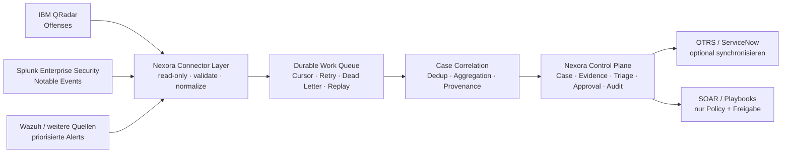

# Nexora SOC — Enterprise-Strategie für ATOS AG

**Arbeitsentwurf für ein Fachgespräch · Stand: 04.08.2026**  
**Adressat:** ATOS AG  
**Status:** Diskussionsgrundlage — keine Angebotszusage, keine SLA- oder Compliance-Zusage.

---

## 1. Executive Summary

Nexora ist als **SOC-Orchestrator und Analysten-Copilot** positioniert. Es ersetzt weder ein
SIEM noch ein EDR. Bestehende Systeme wie IBM QRadar, Splunk Enterprise Security, Wazuh,
ServiceNow und OTRS bleiben die jeweiligen Systeme der Wahrheit für Logdaten, Detektionen und
fachliche Ursprungsvorgänge. Nexora verbindet sie zu einer sicheren Arbeitsoberfläche für
Triage, Case Management, Evidence, Korrelation, Nachvollziehbarkeit und freigabepflichtige
Automatisierung.

Der wirtschaftlich und technisch sinnvolle Enterprise-Schnitt ist **nicht**, alle Rohereignisse
in Nexora zu kopieren. Stattdessen zieht Nexora priorisierte, bereits korrelierte Fälle aus den
Quellsystemen: QRadar-Offenses, Splunk-ES-Notable-Events und vergleichbare Incident-Kandidaten.
Dadurch bleibt die Plattform bei sehr hohen Lograten beherrschbar und reduziert zugleich die
manuelle Wechselarbeit zwischen SIEM, Ticketing, E-Mail und Analysten-Tools.

> **Zielbild:** SIEM korreliert und sucht — Nexora orchestriert, erklärt, dokumentiert und
> unterstützt den Menschen bei der Entscheidung. Kritische Aktionen bleiben human-approved,
> auditierbar und rückrollbar.

## 2. Ausgangslage und vorhandene Basis

Nexora bringt bereits eine produktionsnahe Basis mit:

- React-/TypeScript-Frontend sowie Node.js-/Express-Backend mit PostgreSQL.
- Authentifizierung, RBAC, Audit-Log, Evidence/Chain of Custody, Tickets, Threat Hunting,
  KI-Triage und Reports.
- Adapter-Struktur für Wazuh, QRadar, Splunk, CrowdSec, ServiceNow und OTRS.
- Separate Data Plane mit Intake, Outbox, Korrelation und signiertem Ingress.
- Deduplication, Quell-Provenance, Approval-Gates und sichere Default-Aus-Schalter.
- CI, Tests, E2E, SBOM/Dependency-Scans und umfangreiche Architektur-Dokumentation.

Diese Basis ist gut erweiterbar. Sie ist jedoch heute **nicht** als zentrale Rohdatenpipeline
für 200.000+ Events pro Sekunde dimensioniert. Der gegenwärtige Postgres-basierte Intake und
einzelne Worker sind für den aktuellen Betriebs- und Pilotumfang konzipiert.

## 3. Zielarchitektur für einen Enterprise-Einsatz

Die Quellsysteme behalten die Rohdaten. Nexora speichert für einen Case nur die für die
Bearbeitung nötigen, minimierten Felder, Evidence-Referenzen und einen nachvollziehbaren
Entscheidungsverlauf. Große Rohdaten oder lange Retention gehören in das SIEM bzw. einen
separaten, dafür ausgelegten Archiv-/Data-Lake-Bereich.

### 3.1 Einheitliches Fachobjekt: ExternalCase

QRadar verwendet den Begriff **Offense**. Splunk Enterprise Security verwendet üblicherweise
**Notable Event** bzw. Ergebnisse einer Correlation Search. Nexora behandelt beide einheitlich
als `ExternalCase` und bewahrt dabei Quelle, externe ID, Zeitstempel und Link zur Originalansicht.

| Eigenschaft | Bedeutung |
|---|---|
| `tenantId` | Mandant bzw. organisatorischer Geltungsbereich |
| `source` | Beispielsweise `qradar`, `splunk`, `wazuh` |
| `externalId` | Stabile Offense- bzw. Notable-ID des Quellsystems |
| `sourceUpdatedAt` | Cursor für inkrementelles Abholen |
| `severity`, `status` | Normalisierte Priorität und Lifecycle-Status |
| `sourceUrl` | Rücksprung in die Originalansicht, sofern freigegeben |
| `evidenceRefs` | Minimierte Verweise statt pauschaler Rohdatenkopie |

### 3.2 Pull-Connector-Vertrag

Ein produktiver QRadar- oder Splunk-Connector arbeitet read-only und inkrementell:

1. Ein technisches Konto erhält ausschließlich die benötigten Leserechte.
2. Der Connector zieht offene oder seit dem letzten erfolgreichen Abruf geänderte Fälle.
3. Cursor, Pagination und ein Reconciliation-Lauf verhindern Lücken bei API- oder Netzausfall.
4. Der Schlüssel `tenantId + source + externalId` macht Verarbeitung idempotent.
5. Änderungen am Quellfall aktualisieren den bestehenden Nexora-Case statt Duplikate zu erzeugen.
6. Details und Evidence werden bei Bedarf nachgeladen; keine unkontrollierte Massenreplikation.
7. Rückschreiben ist ein separater, explizit freigegebener Kanal mit Audit — niemals Nebenwirkung
   des Lesepfads.

Ein hybrider Betrieb ist möglich: Webhooks signalisieren neue Fälle schnell, der Pull-Connector
bleibt aber der belastbare Abgleichmechanismus.

## 4. Skalierung und 200.000+ EPS

200.000 Ereignisse pro Sekunde sind eine Rohdaten- und Streaming-Anforderung. Schon bei einer
durchschnittlichen Ereignisgröße von 1 KB entspricht dies ungefähr 17 TB pro Tag. Nexora soll
diese Datenmenge daher nicht als Ticket- oder Case-Objekte persistieren.

Für den beschriebenen Pull-Ansatz sind die entscheidenden Kennzahlen nicht EPS, sondern:

- Anzahl neuer bzw. geänderter Offenses/Notables pro Minute.
- Größe und Abrufhäufigkeit der Evidence.
- gewünschte Zeit bis zur Nexora-Sichtbarkeit.
- Anzahl Mandanten, Quelleninstanzen und paralleler Analysten.

Die nächste Ausbaustufe für sehr hohe Rohdatenraten wäre eine dedizierte Event Plane, etwa mit
Kafka oder Redpanda, horizontalen Normalizern und zustandsbehafteter Stream-Korrelation. Sie
wird nur benötigt, wenn Nexora selbst große Rohdatenströme aufnehmen soll. Für korrelierte
QRadar-/Splunk-Fälle reicht ein horizontal skalierbarer Pull-Worker-Ansatz in aller Regel aus.

**Nicht verhandelbare Betriebsmechanismen:** Backpressure, pro Quelle/Mandant definierte Quotas,
Retry mit begrenzter Wiederholung, Dead-Letter-Queue, Replay, Monitoring, Idempotenz und
geordnetes Processing pro Entity.

Diese Begriffe bedeuten im Betrieb konkret:

- **Backpressure:** Nexora bremst eine Quelle kontrolliert, wenn Verarbeitungskapazität fehlt,
  statt zu überlasten oder auszufallen.
- **Quotas:** Pro Mandant und Quelle begrenzte Ressourcen verhindern, dass ein fehlerhaftes oder
  besonders lautes System die Verarbeitung aller anderen Quellen blockiert.
- **Retry mit Begrenzung:** Fehlgeschlagene Abrufe werden erneut versucht, aber nicht endlos.
- **Dead-Letter-Queue:** Nach den erlaubten Wiederholungen wird ein fehlerhafter Datensatz
  separat abgelegt. Die Hauptverarbeitung läuft weiter und der Fehler bleibt untersuchbar.
- **Replay:** Separat abgelegte Datensätze oder ein klar abgegrenzter Zeitraum können später
  kontrolliert erneut verarbeitet werden.
- **Monitoring:** Betreiber sehen Durchsatz, Verzögerung, Rückstau, Fehler und Ausfälle pro
  Connector und können rechtzeitig reagieren.
- **Idempotenz:** Ein erneut abgerufener QRadar-Offense oder Splunk-Notable erzeugt keinen
  zweiten Nexora-Case, sondern aktualisiert den vorhandenen Fall.
- **Geordnetes Processing pro Entity:** Änderungen für denselben Host, Benutzer oder Incident
  werden in richtiger Reihenfolge verarbeitet, während andere Fälle parallel laufen dürfen.

## 5. Sicherheit, Datenschutz und Governance

- Kein externer Input ohne Schema-Validierung und Normalisierung im Adapter.
- Secrets verschlüsselt speichern, niemals in Logs, UI-Antworten oder Evidence ausgeben.
- Least Privilege: Pull-Connectoren zunächst nur lesend betreiben.
- PII und Rohdaten minimieren; Retention, Export, Löschung und Mandantentrennung vor dem Pilot
  verbindlich festlegen.
- Jede schreibende Aktion in einem Quellsystem: Policy, RBAC, Vier-Augen-Freigabe, Audit und
  möglichst Rückrollstrategie.
- Nexora darf keine automatische Bedrohungsentfernung behaupten oder ausführen, sofern keine
  klar abgegrenzte, freigegebene und auditierte Automation existiert.

NIS2-Readiness-Funktionen und Audit-Evidence unterstützen Nachweisführung, sind aber kein
Konformitäts- oder Zertifizierungsnachweis.

## 6. AI-unterstützte Entwicklung und Copilot-Governance

AI-Coding kann die Umsetzung von Adaptern, Tests, Dokumentation, UI-Grundgerüsten und
Refactorings deutlich beschleunigen. Es ersetzt weder Threat Modeling noch Security-Review,
Lasttest, Datenklassifikation oder die fachliche Freigabe.

Empfohlene Leitplanken im Repository:

- `.github/copilot-instructions.md` für Architektur-, Test- und Security-Grundsätze.
- `AGENTS.md` je Fachbereich für kontextnahe Regeln; beispielsweise Backend, Integrationen,
  Datenbankmigrationen und Frontend.
- Pfadspezifische Instructions für Adapter: Validierung, Cursor, Idempotenz, Retry, Tests und
  redigierte Logs als Pflicht.
- Spezialisierte Rollen für Integration, Tests, Security-Review und Dokumentation.
- CI als verbindliche Instanz: Tests, Lint, SAST, Secret-Scanning, Dependency-Scan,
  Code-Review und Branch Protection.

AI-Agenten dürfen keine produktiven SIEM-/SOAR-Änderungen freigeben. Produktionslogs,
Kundendaten und Secrets gehören nicht unkontrolliert in Prompts. Eine ATOS-spezifische
Freigabe durch Informationssicherheit, Datenschutz und Procurement ist Voraussetzung.

## 7. Umsetzungsvorschlag

| Phase | Ergebnis | Grobe Dauer mit Lead, zwei Entwicklern und DevOps/Security anteilig |
|---|---|---:|
| 0 — Governance | Datenklassifikation, Ziel-SLOs, AI-/CI-Regeln, Sicherheitsfreigabe | 1–2 Wochen |
| 1 — Connector-Fundament | Quellen-Registry, Secret-Referenzen, Cursor, Retry, Dedup, Monitoring | 4–6 Wochen |
| 2 — QRadar-Pilot | Offense-Pull, Status-Mapping, Evidence-Referenzen, Reconciliation | 3–5 Wochen |
| 3 — Splunk-ES-Pilot | Notable-Pull auf demselben Vertrag | 3–5 Wochen |
| 4 — Betriebsreife | HA, Observability, Lasttest, Backup/Recovery, Runbooks, Pilotabnahme | 6–10 Wochen |

Damit ist ein belastbarer Enterprise-Pilot realistisch in etwa **4–7 Kalendermonaten** erreichbar.
Bei nur einer einzelnen Entwicklungsressource ist eher mit **9–15 Monaten** zu rechnen. Diese
Spannen sind Planungswerte; sie hängen insbesondere von API-Zugang, Datenqualität,
Freigabeprozessen, Scope der Rücksynchronisation und den SLA-Anforderungen ab.

## 8. Wirtschaftlichkeit und Nutzenmessung

Der Nutzen entsteht durch weniger Kontextwechsel, weniger doppelte Tickets, schnellere
Erstbewertung und automatisch erzeugte, auditierbare Dokumentation. Der Nachweis soll nicht
über Versprechen, sondern über einen Pilot erfolgen.

### 8.1 Pilot-KPIs

| KPI | Vergleich vor/nach Pilot |
|---|---|
| Bearbeitungszeit pro Incident | Median und 90. Perzentil |
| Zeit bis zur Erstbewertung | Eingang im SIEM bis Analystenentscheidung |
| Duplikate | Mehrfach angelegte Fälle je Quellfall |
| Dokumentationsgrad | Cases mit vollständigem Audit/Evidence-Verlauf |
| Automationsanteil | automatisiert vorbereitete, menschlich freigegebene Schritte |
| Plattformqualität | Connector-Lag, Fehlerquote, Queue-Rückstau, Wiederanläufe |

### 8.2 Kritische Trennung: beobachteter Zeitraum und Nachbau-Szenario

**Was bekannt ist:** Das Repository zeigt einen Entwicklungszeitraum vom 03.06.2026 bis
04.08.2026. Das sind 62 volle Kalendertage bzw. 45 Werktage Montag–Freitag. Bei acht Stunden
pro Werktag ergeben sich **360 theoretische Vollzeitstunden**. Dieser Wert ist keine gemessene
Arbeitszeit: Abend-/Wochenendarbeit, Unterbrechungen, parallele Personen und sonstige
Projektarbeit sind im Git-Verlauf nicht sichtbar.

**Was nicht bekannt ist:** tatsächliche Arbeitsstunden, Gehälter, Beraterrechnungen, Hardware,
Cloud-/Lizenzkosten und bereits angefallene AI-Nutzung. Aus Commits oder Testdateien lassen sich
keine echten Ist-Kosten ableiten.

Die folgenden 3.000–4.800 Stunden sind deshalb **ausdrücklich kein Rückschluss auf deine
geleisteten Stunden.** Sie modellieren, wie viel Aufwand ein konventionelles Team für einen
professionellen Nachbau desselben Funktionsumfangs mit Architektur, Tests, Security,
Dokumentation und Betriebsreife typischerweise einplanen müsste. Sie entsprechen einem
Teamaufwand von rund 1,9–3,0 Vollzeit-Personenjahren und können parallel erbracht werden.
Es handelt sich um eine Marktwert-/Wiederbeschaffungsbetrachtung, keine Abrechnung und keine
Preisbindung.

| Arbeitsblock für einen professionellen Nachbau | Untere Annahme | Obere Annahme |
|---|---:|---:|
| Produkt, Architektur, ADRs und Projektsteuerung | 350 h | 600 h |
| Backend, Domäne, APIs und Persistenz | 800 h | 1.300 h |
| Frontend und Analysten-Workflows | 450 h | 800 h |
| Integrationen, Data Plane und Korrelation | 550 h | 950 h |
| Security, Tests, CI/CD, Dokumentation und Betriebsreife | 850 h | 1.150 h |
| **Gesamter Nachbauaufwand** | **3.000 h** | **4.800 h** |

Die Schätzung enthält einen üblichen Qualitätsanspruch mit Tests, Security und Dokumentation;
sie setzt nicht voraus, dass jede Funktion bereits eine formale Enterprise-SLA erfüllt.

Für die Kostenrechnung wird ein Risikopuffer von 15 % angesetzt. Die Stundensätze sind bewusst
als **Planungsannahmen** ausgewiesen und müssen für einen konkreten ATOS-Auftrag durch
Einkauf/Controlling ersetzt werden.

| Umsetzungsszenario | Annahme | Nachbaukosten inklusive 15 % Risikopuffer |
|---|---|---:|
| Inhouse | 75 EUR voll belastete Kosten je Stunde | **ca. 259.000–414.000 EUR** |
| Externe Spezialisten | 115 EUR je Stunde | **ca. 397.000–635.000 EUR** |
| Agentur inklusive Steuerung/Gewährleistung | 140 EUR je Stunde | **ca. 483.000–773.000 EUR** |

Der bisher genannte Bereich von 200.000–450.000 EUR war damit zu grob. Die belastbarere
Lesart lautet: **Für einen professionellen Nachbau des heutigen Umfangs sind typischerweise
etwa 260.000–635.000 EUR anzusetzen; bei einer Agentur kann der Wert bis rund 770.000 EUR
reichen.** Die tatsächlichen eigenen Ausgaben können wesentlich darunter liegen, wenn eigene
Arbeitszeit, vorhandene Infrastruktur und AI-unterstützte Entwicklung genutzt wurden.

**Einbringung bei ATOS:** Nexora wird ATOS als bereits entwickelter Ausgangsbestand übergeben
und innerhalb der Organisation weiterentwickelt. Damit sind die dargestellten Beträge keine
Rechnung an ATOS, sondern vermiedene zukünftige Nachbau- und Beschaffungskosten. ATOS kann
unmittelbar auf der vorhandenen Basis aufsetzen und die Investition auf die für den Einsatz
entscheidenden Integrationen, Betriebsreife und Prozesse konzentrieren.

### 8.3 Potenziell vermiedener Nachbauaufwand durch AI-gestützte Entwicklung

Eine echte, bereits realisierte AI-Ersparnis kann nur aus Zeiterfassung oder vergleichbaren
Projektwerten berechnet werden und wird hier **nicht behauptet**. Die folgende Rechnung zeigt
nur potenziell vermiedenen Aufwand innerhalb des konventionellen Nachbau-Szenarios. Sie nimmt
an, dass 60 % dieses Nachbauaufwands für AI-Unterstützung geeignet sind (Code-Grundgerüste,
Tests, Dokumentation, Refactoring). Die übrigen Anteile — Architektur,
Security-Entscheidungen, Abnahmen, Lasttests und Betrieb — werden **nicht** als AI-Ersparnis
gerechnet.

| Szenario | Produktivitätsgewinn in AI-geeigneten Anteilen | Eingesparte Arbeitszeit | Wert bei 115 EUR/h |
|---|---:|---:|---:|
| Konservativ | 15 % | 270–432 h | ca. 31.000–50.000 EUR |
| Planungswert | 25 % | 450–720 h | ca. 52.000–83.000 EUR |
| Optimistisch, nicht budgetieren | 35 % | 630–1.008 h | ca. 72.000–116.000 EUR |

Der **Planungswert** entspricht ungefähr 2,8–4,5 Entwickler-Monaten Kapazität innerhalb eines
konventionellen Nachbaus. Er ist nur dann eine echte Geldersparnis, wenn dadurch externe
Beauftragung, Neueinstellungen oder zusätzliche Projektmonate entfallen. Bei fest angestellten
Mitarbeitenden ist es zunächst ein Kapazitätsgewinn, der für mehr Qualität, zusätzliche
Integrationen oder schnellere Lieferung eingesetzt werden kann.

### 8.4 Zusätzlicher Aufwand für den Enterprise-Pilot

Der nächste Schritt — QRadar-Offense-Pull oder Splunk-ES-Notable-Pull, ITSM-Synchronisation,
Observability, HA-/Recovery-Konzept und Pilotabnahme — ist **nicht** in der bisherigen
Nachbaukosten-Schätzung enthalten. Als getrennte Planungsgröße sind dafür etwa 1.500–3.000
Stunden anzusetzen. Bei 115 EUR/h zuzüglich 15 % Risikopuffer entspricht das ungefähr
**198.000–397.000 EUR**.

Eine vollständige Rohdaten-Event-Plane für 200.000+ EPS wäre ein getrenntes Großprojekt und
nicht Voraussetzung für den korrelierten-Fälle-Ansatz.

### 8.5 Wirtschaftlichkeit im Betrieb

Der Business Case einer Einführung sollte nach dem Pilot mit realen Betriebsdaten berechnet
werden:

`Jahresnutzen = (Incidents pro Jahr × Minutenersparnis je Incident ÷ 60 × voll belasteter Analystenstundensatz) + vermiedene externe Leistungen − jährliche Betriebs- und Lizenzkosten`

Erst gemessene Werte für Incident-Volumen, Triagezeit, Doppelarbeit, Connector-Lag und
Auditaufwand machen aus dem Potenzial eine belastbare ROI-Rechnung.

## 9. Entscheidungen vor dem Start

1. Welches System ist Pilotquelle: QRadar oder Splunk Enterprise Security?
2. Welches ITSM-System soll zunächst angebunden werden: OTRS oder ServiceNow?
3. Welcher Mandanten-, Datenresidenz- und Retention-Rahmen gilt?
4. Nur read-only Pull im Pilot oder auch kontrollierte Rücksynchronisation?
5. Welche SLOs gelten für Connector-Lag, Verfügbarkeit und Recovery?
6. Welche AI-Nutzung ist durch Informationssicherheit und Datenschutz freigegeben?

## 10. Fazit

Nexora kann sich zu einer Enterprise-SOC-Orchestrierungsplattform entwickeln, wenn der Fokus
auf der Orchestrierung **korrelierter Fälle** liegt. Der empfohlene erste Schritt ist ein
read-only QRadar- oder Splunk-Pilot mit belastbarer Synchronisation, klarer Messung und
schrittweiser Betriebsreife. Das reduziert Risiko, macht wirtschaftlichen Nutzen sichtbar und
vermeidet, dass Nexora unnötig zu einem zweiten SIEM ausgebaut wird.
