# UML & Architecture — SOC Orchestrator (Nexora SOC)

> Complete, layered architecture documentation, generated from the actual code.
> All diagrams in **Mermaid** — renderable in GitHub, VS Code, JetBrains and via `docs/01-architecture/uml.html`.
>
> **As of 2026-06-20** (v0.1.0), **addendum 2026-08: section 10 — Deployment Center** (ADR-041/043,
> gate chain · run lifecycle · ER · sequence). Extended beyond the board version with: control plane/provisioning
> (6 entities + lifecycles), NIS2 readiness & evidence, auth wave 3 (MFA/TOTP · OIDC · WebAuthn),
> notifications outbound, CrowdSec WAN integration and the correlation engine (CE-1…CE-5). The new
> backend modules from migrations 030/033–040 are captured as class and sequence diagrams; the
> ER (section 7) still maps the 17 core tables.
>
> **Reading order (C4 + UML 2.5, coarse → fine):**
> 1. Context → 2. Container → 3. Components/layers → 4. Classes per module (all operations)
> → 5. Sequence/collaboration (interplay) → 6. State → 7. ER (data) → 8. Frontend → 9. Function index.
>
> **Diagram index (new modules 2026-06):** 3.2 Control plane/provisioning · 3.3 Auth wave 3 ·
> 3.4 Notifications/CrowdSec/correlation · 4.7 Provisioning classes · 4.8 NIS2 classes · 4.9 Auth-wave-3 classes ·
> 4.10 Notifications outbound · 4.11 CrowdSec · 4.12 Correlation engine · 5.8–5.13 new sequences.
> Lifecycles of the new entities (provisioning/NIS2) live in the respective class diagrams
> (4.7/4.8); states in section 6 = core (6.1–6.4); ER in section 7 = 17 core tables.

---

## 1. System Context (C4 Level 1)

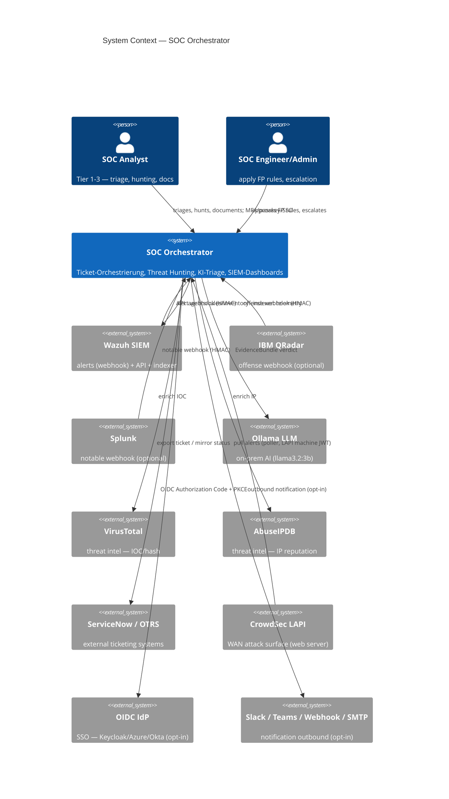

---

## 2. Container Diagram (C4 Level 2)

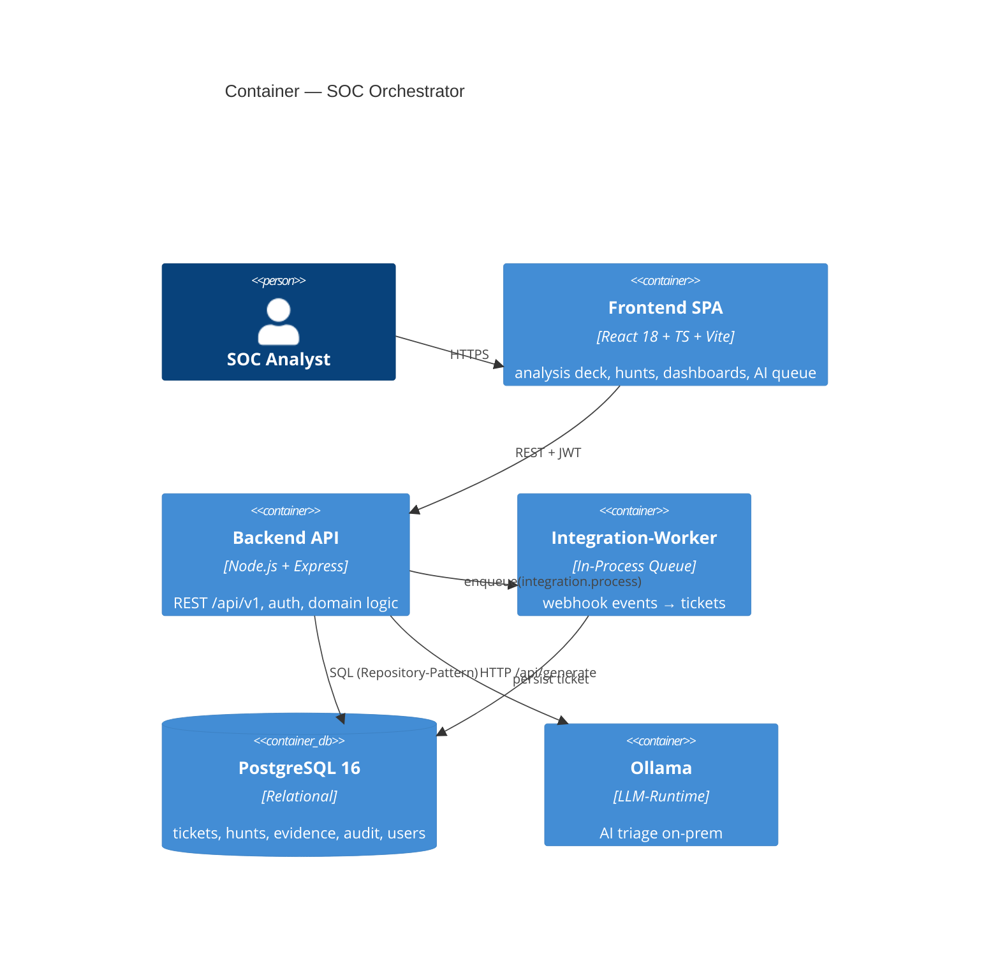

**REST surface (`/api/v1`):** `/health · /auth · /tickets · /integrations · /hunts · /wazuh · /siem · /threat-intel · /evidence · /detections · /yara · /agent · /audit · /qradar`
plus the 2026 additions `/auth/oidc · /auth/webauthn · /auth/mfa · /auth/mfa-setup · /mfa · /tokens · /profile · /notifications · /provisioning · /nis2 · /agent/guardrails · /agent/metrics`.

> **Feature gates (ENV, off by default):** `MFA_ENABLED`, `OIDC_*`, `WEBAUTHN_*`, `API_TOKENS_ENABLED`,
> `NOTIFICATIONS_OUTBOUND_ENABLED`, `EXTERNAL_TICKET_EXPORT_ENABLED`, `CROWDSEC_*`, `FQDN_RESOLVER_ENABLED`.
> Live deployt (`41d8d92`): MFA + PAT. Lokal/unreleased: OIDC, WebAuthn, E-Mail/SMTP-Kanal, NIS2-Review-Kadenz, CrowdSec-Live-ENV.

---

## 3. Backend — Layers / Components

Clean layering with the **repository pattern** (InMemory for tests/dev, Postgres for `DB_ENABLED=true`) and an **adapter layer** for every external integration. Dependencies point inward (routes → services → domain ← repositories).

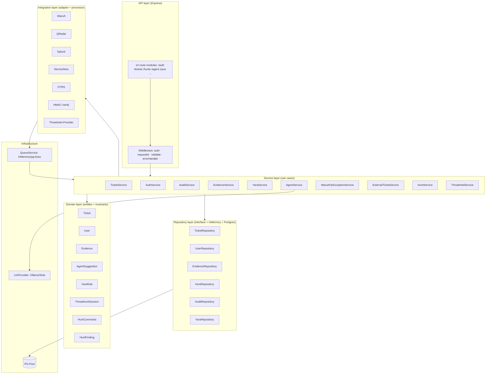

---

## 3.2 Control Plane / Provisioning (Phase-6 foundation)

A dedicated layer for managing nodes/agents. **No apply/remote/network channel** — enforced by test: the server response never contains executable commands. The bootstrap credential (`EnrollmentToken`, one-time) and the operational credential (`NodeCredential`, long-lived) are separate; both are stored only as a SHA-256 hash. Audit is append-only (DB trigger).

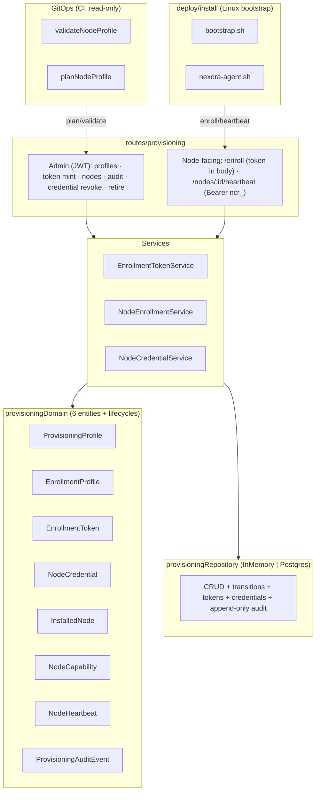

---

## 3.3 Auth Wave 3 (MFA · OIDC · WebAuthn)

Three additive factors alongside the existing password login. All behind ENV gates (off by default). MFA/TOTP is implemented in-house (RFC 6238, no external lib); the OIDC and WebAuthn services are **network-/crypto-free** by injecting HTTP/jose and `@simplewebauthn` as functions (boot wiring in `*Instance.js`).

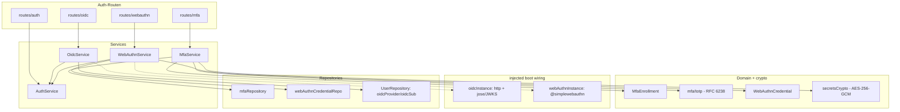

---

## 3.4 Notifications Outbound · CrowdSec · Correlation Engine

Three more 2026 building blocks. **Notifications outbound** is a best-effort dispatcher with four channels (off by default). **CrowdSec** is a complete ingest path (adapter + LAPI client + poller + processor) that pulls WAN alerts into tickets through the same integration pipeline (dedup/normalize/queue). The **correlation engine** enriches flows entity-centrically with provenance.

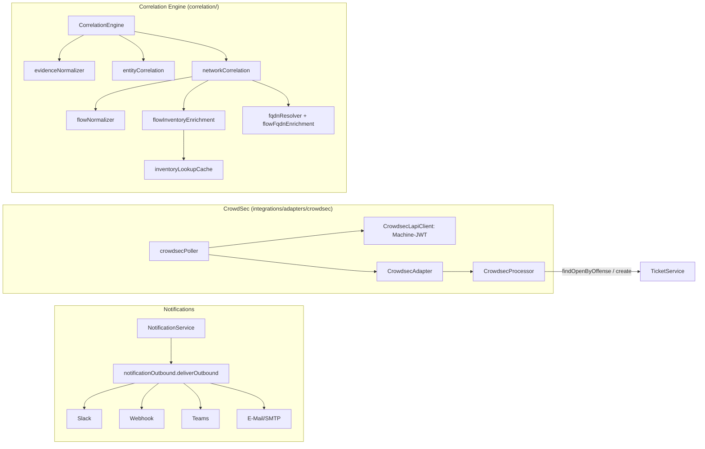

---

## 4. Class Diagrams per Module

### 4.1 Domain — Entities (core invariants)

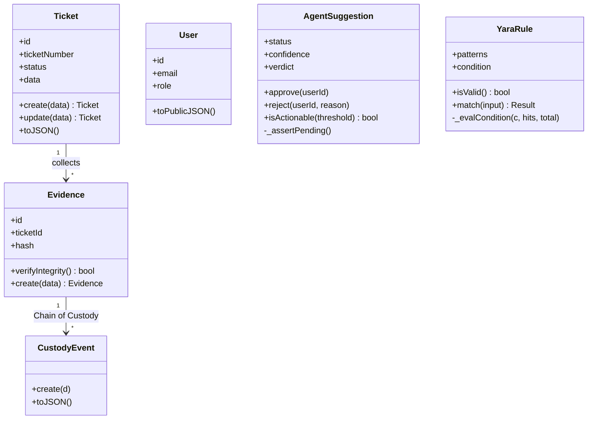

### 4.2 Services (use-case orchestration)

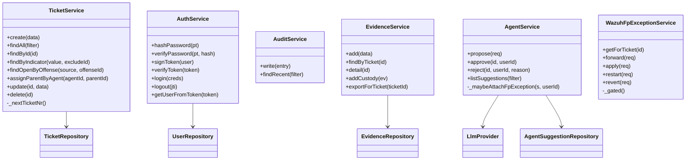

### 4.3 Repository Pattern (swappable persistence)

Every aggregate root: **abstract interface** + **InMemory** (tests/dev) + **Postgres** (`DB_ENABLED`), selected via a `*Factory`. Example Ticket — identical pattern for User, Evidence, Audit, Yara, AgentSuggestion, WazuhFpException, Hunt.

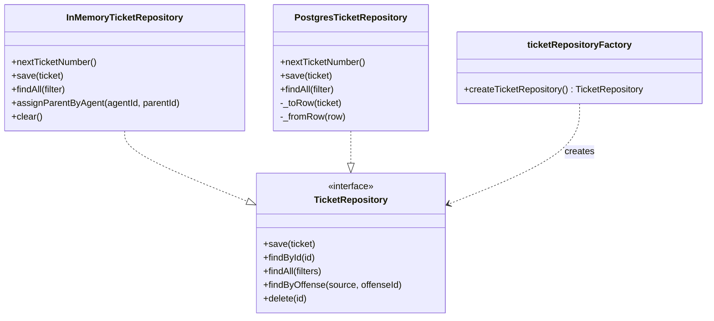

### 4.4 Integration Adapters (SIEM → ticket, ITSM export)

Two adapter families: **ingest** (`BaseAdapter`: validate → normalize → toTicketDraft) for SIEM webhooks, and **export** (`ExternalTicketAdapter`: mapToExternal → sendTicket) for ITSM.

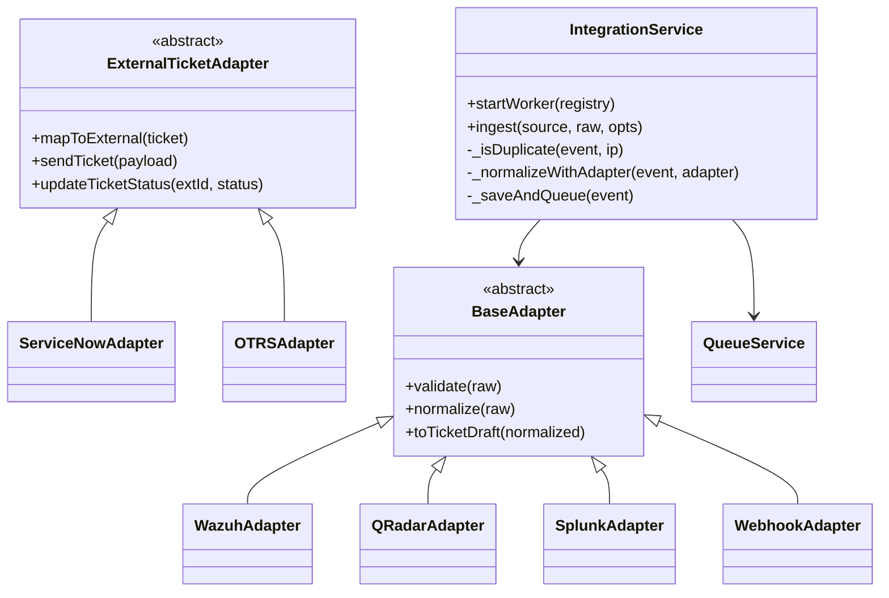

### 4.5 AI Agent (EvidenceBundle → LLM → evidence floor)

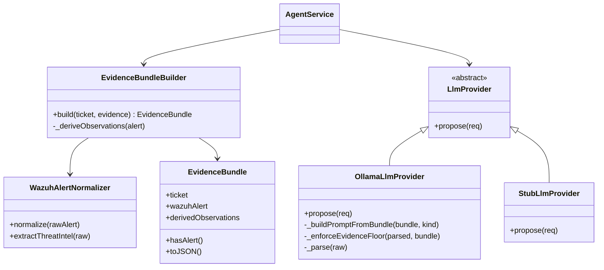

### 4.6 Threat Hunting (Domain · Service · Repository)

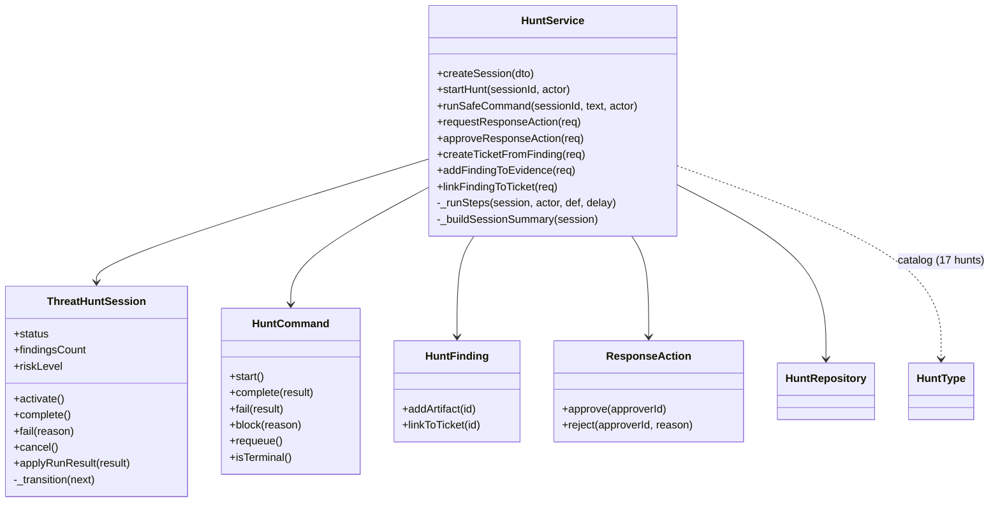

### 4.7 Provisioning Domain (6 entities + credentials)

All entities follow the house style: `static create()`/`mint()` validates, `transitionTo()` is **immutable** (new instance, guarded transition). `EnrollmentToken` and `NodeCredential` return the plaintext only **once** and store solely the SHA-256 hash; `toJSON()` never returns hash/plaintext. `ProvisioningAuditEvent` deliberately has **no** `update()`/`delete()` (append-only).

```mermaid
classDiagram
    class ProvisioningProfile {
        +status: ProvisioningProfileStatus
        +create(data) ProvisioningProfile
        +update(patch)
        +transitionTo(status)
        +toJSON()
    }
    class EnrollmentProfile {
        +capabilities: string[]
        +expiresAt: Date
        +status: EnrollmentProfileStatus
        +create(data)
        +transitionTo(status)
    }
    class EnrollmentToken {
        -tokenHash: SHA256
        +prefix: string
        +mint(enrollmentProfileId, ttlSeconds) EnrollmentToken$
        +hash(raw) string$
        +isExpired() bool
        +isActive() bool
        +toJSON() PublicEnrollmentToken
    }
    class NodeCredential {
        -tokenHash: SHA256
        +prefix: string
        +status: NodeCredentialStatus
        +mint(nodeId) NodeCredential$
        +hash(raw) string$
        +isActive() bool
        +toJSON() PublicNodeCredential
    }
    class InstalledNode {
        +status: InstalledNodeStatus
        +fqdn: string
        +ip: string
        +os: string
        +version: string
        +lastSeenAt: Date
        +create(data)
        +update(patch)
        +transitionTo(status)
    }
    class NodeCapability {
        +name: CapabilityName
        +create(data)
    }
    class NodeHeartbeat {
        +status: NodeHeartbeatStatus
        +agentVersion: string
        +create(data)
    }
    class ProvisioningAuditEvent {
        +type: AuditEventType
        +create(input) ProvisioningAuditEvent
        +toJSON()
    }
    class ProvisioningProfileStatus {
        <<enumeration>>
        draft
        validated
        approved
        retired
    }
    class EnrollmentProfileStatus {
        <<enumeration>>
        active
        expired
        revoked
    }
    class NodeCredentialStatus {
        <<enumeration>>
        active
        revoked
    }
    class InstalledNodeStatus {
        <<enumeration>>
        pending
        enrolled
        active
        stale
        retired
    }
    class NodeHeartbeatStatus {
        <<enumeration>>
        healthy
        degraded
        offline
    }
    EnrollmentProfile "1" --> "*" EnrollmentToken : mints
    InstalledNode "1" --> "*" NodeCredential : mints
    InstalledNode "1" --> "*" NodeCapability : reports
    InstalledNode "1" --> "*" NodeHeartbeat : sends
    InstalledNode --> ProvisioningProfile : profileId
```

### 4.8 NIS2 Readiness & Evidence

**Honest** readiness support — not a compliance certification (enforced by test, stated in the
disclaimer). The static 10-control catalog lives in code (`nis2ControlCatalog.js`). `Nis2Assessment`
is immutable (`update()` returns a new instance; `controlKey` unchangeable). The `Nis2ReadinessService`
joins catalog ⨝ assessments ⨝ evidence and computes the signals `overdue`/`missingEvidence`/
`needsReview`/`reviewDue` — `addressed` ohne Evidence ⇒ `needsReview`.

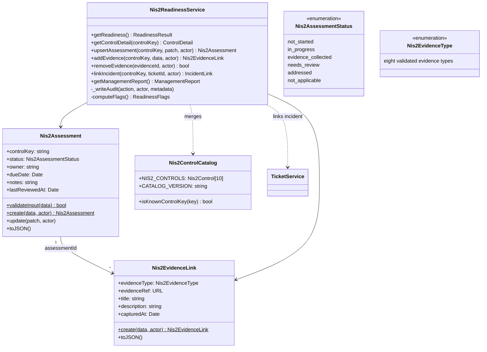

### 4.9 Auth Wave 3 (MFA · OIDC · WebAuthn)

Three factors, same shape: a thin domain + a service that orchestrates the injected crypto/network. Secrets leave the service only once (TOTP secret on `beginEnrollment`, recovery codes on `activate`); WebAuthn/OIDC error paths return a single, non-discriminating message (reason only in the server log).

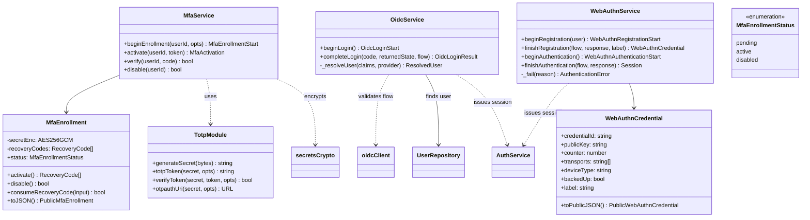

### 4.10 Notifications Outbound (dispatcher + channels)

`deliverOutbound` is best-effort (never throws), gated via `NOTIFICATIONS_OUTBOUND_ENABLED` + a configured target. Payload builders are pure functions; URLs/SMTP creds never appear in return values or logs (only channel IDs). `nodemailer` is loaded lazily (inert without the email channel).

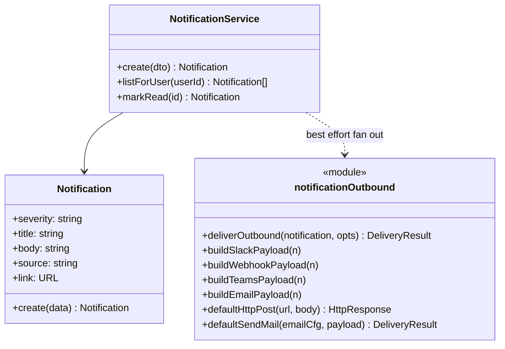

### 4.11 CrowdSec WAN Integration

A complete ingest path analogous to the SIEM adapters: the poller fetches alerts from the LAPI via machine JWT, the adapter validates+normalizes (schema + mapper), the processor creates/updates a ticket (1 ticket per `crowdsec:alert:<id>`, recurrence within the time window). Inherits dedup/normalize/queue from the integration pipeline.

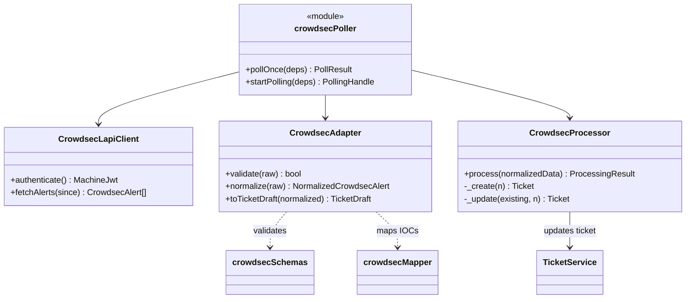

### 4.12 Correlation Engine (CE-1 … CE-5)

Enriches flows entity-centrically and carries **provenance** (source per value). Principle: never invent values — if something is missing, then `null` + `missingReason` + `provenance`. Host NIC and firewall interface stay separate; FQDN source rank: event computer > inventory > DNS forward-confirm (A record must == flow IP, no fake).

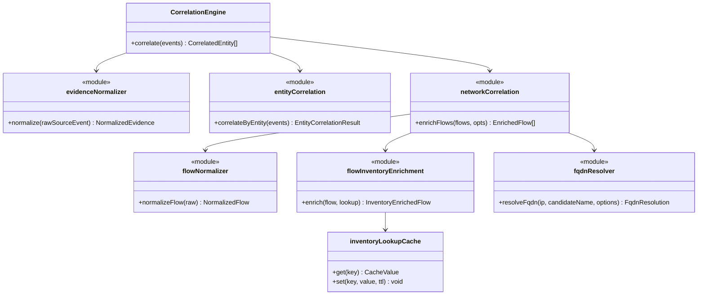

---

## 5. Sequence Diagrams — how the functions work together

### 5.1 Login & JWT

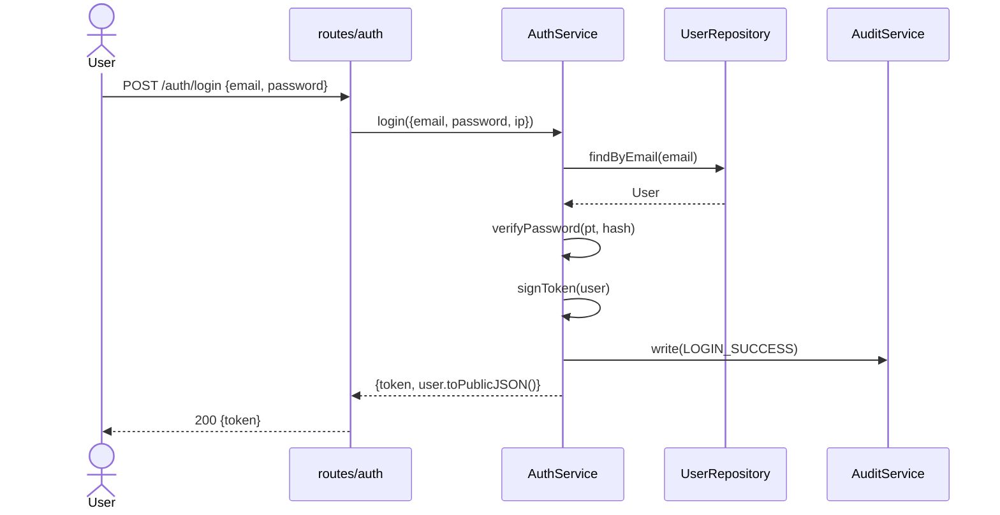

### 5.2 Create ticket + audit (field names, no values — GDPR)

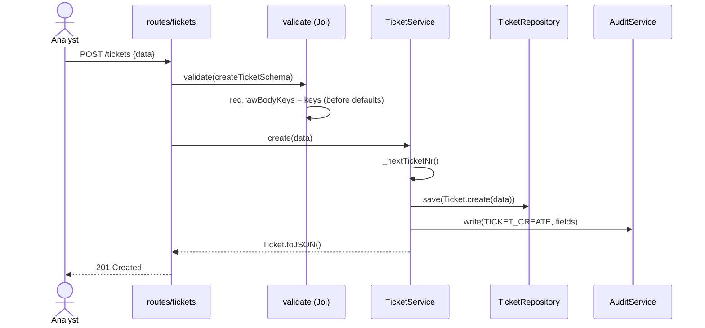

### 5.3 Webhook → integration pipeline → ticket (Wazuh)

```mermaid
sequenceDiagram
    participant W as Wazuh
    participant R as routes/integrations
    participant H as hmac.verify
    participant IS as IntegrationService
    participant Q as QueueService
    participant IP as IntegrationProcessor
    participant WP as WazuhProcessor
    participant TS as TicketService
    W->>R: POST /integrations/wazuh (HMAC)
    R->>H: verifyWebhookSignature(req, secret)
    H-->>R: ok
    R->>IS: ingest('wazuh', raw, {ip})
    IS->>IS: _isDuplicate(event, ip)
    IS->>IS: _normalizeWithAdapter(event, WazuhAdapter)
    IS->>Q: enqueue(integration.process)
    IS-->>R: 202 Accepted
    Q->>IP: process(job)
    IP->>WP: process(normalized)
    WP->>WP: _findOrCreateCase / _enrichFromApi
    WP->>TS: create / update (+ assignParentByAgent)
```

### 5.4 KI-Agent: propose → Bundle → Ollama → Evidence-Floor → approve

```mermaid
sequenceDiagram
    actor A as Analyst
    participant R as routes/agent
    participant S as AgentService
    participant B as EvidenceBundleBuilder
    participant N as WazuhAlertNormalizer
    participant L as OllamaLlmProvider
    participant Repo as AgentSuggestionRepository
    A->>R: POST /agent/propose {ticketId, kind}
    R->>S: propose({ticket, kind, evidence})
    S->>B: build(ticket, evidence)
    B->>N: normalize(rawAlert) + extractThreatIntel
    B-->>S: EvidenceBundle
    S->>L: propose({bundle})
    L->>L: _buildPromptFromBundle (VT + Leitplanken)
    L->>L: _parse(raw)
    L->>L: _enforceEvidenceFloor (VT>=5 -> confirmed_incident)
    L-->>S: {verdict, rationale, confidence}
    S->>Repo: save(AgentSuggestion[pending])
    S-->>A: 201 {suggestion}
    Note over A,Repo: human approves separately: approve(id, userId)
```

### 5.5 Threat Hunt: Session → Runner → Finding → Ticket/Evidence

```mermaid
sequenceDiagram
    actor A as Analyst
    participant R as routes/hunts
    participant HS as HuntService
    participant HT as HuntType (catalog)
    participant Repo as HuntRepository
    participant TS as TicketService
    participant ES as EvidenceService
    A->>R: POST /hunts {huntType, target}
    R->>HS: createSession(dto)
    HS->>Repo: saveSession(planned)
    A->>R: POST /hunts/:id/start
    R->>HS: startHunt(sessionId, actor)
    HS->>HT: build(session)
    HS->>HS: _runSteps (Logs + Findings)
    HS->>Repo: saveFinding · session.complete()
    A->>R: POST /hunts/:id/findings/:fid/ticket
    R->>HS: createTicketFromFinding(...)
    HS->>TS: create(ticketDraft)
    HS->>ES: add(evidence)
```

### 5.6 Threat Intel Enrichment (Provider-Aggregation + Cache)

```mermaid
sequenceDiagram
    actor A as Analyst+
    participant R as routes/threatIntel
    participant Auth as requireAuth/requireRole
    participant TIS as ThreatIntelService
    participant C as ThreatIntelCache
    participant VT as VirusTotalProvider
    participant AB as AbuseIpDbProvider
    A->>R: POST /threat-intel/enrich {type, value}
    R->>Auth: requireAuth + requireRole('analyst')
    Auth-->>R: 403 for viewer / ok for analyst+
    R->>TIS: enrich({indicatorType, indicatorValue})
    TIS->>TIS: validateIndicator(type, value, max 2048)
    TIS->>C: get(key)
    alt Cache-Miss
        TIS->>VT: enrich(type, value)
        TIS->>AB: enrich(type, value)
        TIS->>C: set(key, result, ttl)
    end
    TIS-->>A: {verdict, score, tags, summary}
```

### 5.7 Wazuh FP exception: forward → apply → restart (four-eyes, gated)

```mermaid
sequenceDiagram
    actor AN as Analyst
    actor EN as Engineer
    participant R as routes/tickets
    participant S as WazuhFpExceptionService
    participant B as wazuhRuleExceptionBuilder
    participant API as WazuhApiClient
    AN->>R: POST /fp-exception/forward
    R->>S: forward({ticketId, scope, actor})
    S->>S: status=submitted (NO write)
    EN->>R: POST /fp-exception/apply
    R->>S: apply({ticketId, scope, actor})
    S->>S: _gated (WAZUH_FP_APPLY_ENABLED?)
    S->>B: buildFpException(scope) + scopeHash
    S->>API: putRuleFile + validateConfiguration
    EN->>R: POST /fp-exception/restart
    R->>S: restart({exceptionId, actor})
    S->>API: restartManager (separate, explicit)
```

### 5.8 Node enrollment → credential handoff → heartbeat (provisioning)

The bootstrap token (one-time) is consumed **atomically** on enroll (consume before mint); the node receives a long-lived `NodeCredential` (`ncr_…`, plaintext only once). Heartbeats run exclusively over the node credential (Bearer); the enrollment token no longer works for that (401). The server response never contains executable commands (only `accepted/serverTime/desiredProfileId`).

```mermaid
sequenceDiagram
    participant N as Node (bootstrap.sh)
    participant R as routes/provisioning
    participant ETS as EnrollmentTokenService
    participant NES as NodeEnrollmentService
    participant NCS as NodeCredentialService
    participant Repo as ProvisioningRepository
    N->>R: POST /enroll {token in body}
    R->>ETS: authenticate(token) (hash comparison)
    ETS->>Repo: findEnrollmentTokenByHash + consume (single-use)
    R->>NES: enroll(...) Node create/update → enrolled
    NES->>NCS: mintForNode(nodeId) → ncr_… (plaintext once)
    NES->>Repo: append ProvisioningAuditEvent (redacted)
    R-->>N: 201 {nodeId, nodeCredential}
    loop operation
        N->>R: POST /nodes/:id/heartbeat (Bearer ncr_)
        R->>NCS: authenticate(credential) + nodeId-Bindung
        R->>Repo: record NodeHeartbeat + lastSeen → active
        R-->>N: 200 {accepted, serverTime, desiredProfileId}
    end
```

### 5.9 NIS2 — link incident as evidence + management report

`linkIncident` validates the ticket (else 404) and creates a ticket-evidence link with **only** safe snapshot fields (INC number, title, priority, state) — **no PII**. The audit entry carries only the INC number. The management report is read-only and states the disclaimer.

```mermaid
sequenceDiagram
    actor AD as Admin
    participant R as routes/nis2
    participant S as Nis2ReadinessService
    participant TS as TicketService
    participant Repo as Nis2Repository
    participant Aud as AuditService
    AD->>R: POST /nis2/controls/:key/incident-evidence {ticketId}
    R->>S: linkIncident(controlKey, {ticketId}, actor)
    S->>TS: findById(ticketId) (404 falls fehlt)
    S->>S: safeIncidentSnapshot(ticket) (no PII)
    S->>Repo: getAssessment | create + addEvidence(ticket)
    S->>Aud: NIS2_EVIDENCE_LINKED {controlKey, ticketRef}
    S-->>AD: 201 Evidence-Link
    AD->>R: GET /nis2/report
    R->>S: getManagementReport()
    S->>Repo: listAssessments + listAllEvidence
    S-->>AD: {meta(disclaimer), summary(byStatus, coverage), controls}
```

### 5.10 MFA — enrollment + login challenge (2nd factor)

The TOTP secret is stored encrypted; recovery codes only as a hash. On login the 2nd factor checks TOTP **or** a one-time recovery code. Org enforcement (`mfaRequired`) requires the setup-token flow before first sign-in.

```mermaid
sequenceDiagram
    actor U as User
    participant R as routes/mfa
    participant S as MfaService
    participant E as MfaEnrollment
    participant C as secretsCrypto
    U->>R: POST /mfa/begin
    R->>S: beginEnrollment(userId)
    S->>C: encryptSecret(generateSecret())
    S->>E: create({userId, secretEnc}) (pending)
    S-->>U: {secret, otpauthUri} (once, for QR)
    U->>R: POST /mfa/activate {token}
    R->>S: activate(userId, token)
    S->>S: verifyToken(secret, token) (RFC 6238 ±1)
    S->>E: activate() → recovery codes (once)
    S-->>U: {recoveryCodes}
    Note over U,S: login: POST /auth/mfa {code} → MfaService.verify (TOTP or recovery code)
```

### 5.11 OIDC SSO (Authorization Code + PKCE)

The flow state (state/nonce/codeVerifier) lives in a short-lived signed httpOnly cookie (no server state). The order is security-critical: state check → token exchange → **signature** (JWKS) → **claims** (incl. nonce) → user resolution. Account linking only when `email_verified`.

```mermaid
sequenceDiagram
    actor U as User
    participant R as routes/oidc
    participant S as OidcService
    participant IdP as OIDC IdP
    participant V as verifyIdToken (jose/JWKS, injiziert)
    participant UR as UserRepository
    U->>R: GET /auth/oidc/login
    R->>S: beginLogin() (PKCE/state/nonce)
    R-->>U: 302 → IdP (+ signierter Flow-Cookie)
    U->>IdP: authentication
    IdP-->>U: 302 /callback?code&state
    U->>R: GET /auth/oidc/callback
    R->>S: completeLogin({code, returnedState, flow})
    S->>S: state == flow.state ?
    S->>IdP: exchangeCode (codeVerifier)
    S->>V: verifyIdToken (Signatur)
    S->>S: validateIdTokenClaims (iss/aud/exp/nonce)
    S->>UR: _resolveUser (existing|linked|created)
    S-->>R: session (identical to password login)
    R-->>U: 302 / (+ Token-Cookie)
```

### 5.12 WebAuthn / passkey (register + login ceremony)

Register stores a credential only when `verified === true`. Login is usernameless; on success
the counter-clone detection kicks in (new signature counter must increase). All error paths return
the same message (reason only to the log). The crypto verification is injected (`@simplewebauthn`).

```mermaid
sequenceDiagram
    actor U as User
    participant R as routes/webauthn
    participant S as WebAuthnService
    participant Cl as webauthnClient (Options/Challenge)
    participant Vf as verify* (@simplewebauthn, injiziert)
    participant Repo as WebAuthnCredentialRepo
    U->>R: POST /auth/webauthn/register/begin
    R->>S: beginRegistration(user)
    S->>Cl: buildRegistrationOptions + challenge
    S-->>U: {options, flow}
    U->>R: POST /register/finish {response}
    R->>S: finishRegistration({flow, response, label})
    S->>Vf: verifyRegistration (verified?)
    S->>Repo: create(WebAuthnCredential)
    Note over U,Repo: login (usernameless)
    U->>R: POST /auth/webauthn/login/begin
    R->>S: beginAuthentication() → challenge
    U->>R: POST /login/finish {response}
    R->>S: finishAuthentication({flow, response})
    S->>Repo: findByCredentialId
    S->>Vf: verifyAuthentication
    S->>S: Counter-Clone-Check (newCounter > stored)
    S->>Repo: updateCounter
    S-->>U: session
```

### 5.13 CrowdSec — Poll → Adapter → Ticket (WAN)

The poller authenticates via machine JWT, fetches new alerts, the adapter normalizes, the processor deduplicates per offense (`crowdsec:alert:<id>`) and creates or updates (recurrence).

```mermaid
sequenceDiagram
    participant P as crowdsecPoller
    participant L as CrowdsecLapiClient
    participant A as CrowdsecAdapter
    participant PR as CrowdsecProcessor
    participant TS as TicketService
    participant Aud as AuditService
    P->>L: authenticate() → Machine-JWT
    P->>L: fetchAlerts(since)
    L-->>P: raw Alerts
    P->>A: validate + normalize (Schema/Mapper)
    P->>PR: process(normalized)
    PR->>TS: findOpenByOffense('crowdsec', offenseId)
    alt fresh within window
        PR->>TS: update (alertCount++, merge IOCs)
    else new / too old
        PR->>TS: create(draft)
        PR->>Aud: CROWDSEC_TICKET_CREATED
    end
```

### 5.14 Analysis deck: read evidence → schedule-on-read → worker → deck renders

The deck is **evidence-driven**: it renders the materialized `ParsedEvidence`, not the flat ticket fields. On first open (or after a ticket change) the read route itself schedules a correlation job (`schedule-on-read`); the worker normalizes the ticket and materializes the result; UI polling picks it up. See
[Analysis deck — data flow](analysis-deck-data-flow.md).

```mermaid
sequenceDiagram
    participant UI as Deck (useCorrelationPolling)
    participant R as GET /tickets/:id/evidence
    participant DB as correlation_results
    participant SCH as Scheduler (pg-boss)
    participant W as CorrelationWorker
    participant N as normalizeEvidence(ticket)
    UI->>R: poll evidence
    R->>DB: findLatestResultByTicket
    alt no/superseded result
        R->>SCH: schedule-on-read (idempotent, inputHash)
        R-->>UI: data=null, status=pending
        SCH->>W: Job
        W->>N: Ticket → ParsedEvidence (wazuh|generic + flatNetwork)
        W->>DB: saveResult (source_revision re-check)
    else result present
        R-->>UI: data=ParsedEvidence, status=current
    end
    UI->>R: poll again (2s→backoff)
    R-->>UI: data=ParsedEvidence → render sections
```

---

## 6. State Diagrams (lifecycles)

### 6.1 Ticket

```mermaid
stateDiagram-v2
    [*] --> open
    open --> in_progress : assign
    in_progress --> open : unassign
    in_progress --> closed : resolve / false_positive
    open --> closed : close
    closed --> [*]
```

### 6.2 ThreatHuntSession

```mermaid
stateDiagram-v2
    [*] --> planned
    planned --> active : activate / startHunt
    active --> completed : complete
    active --> failed : fail(reason)
    planned --> cancelled : cancel
    active --> cancelled : cancel
    completed --> [*]
    failed --> [*]
    cancelled --> [*]
```

### 6.3 HuntCommand

```mermaid
stateDiagram-v2
    [*] --> queued
    queued --> running : start
    queued --> blocked : block(reason)
    blocked --> queued : requeue
    running --> completed : complete
    running --> failed : fail
    completed --> [*]
    failed --> [*]
```

### 6.4 AgentSuggestion / ResponseAction

```mermaid
stateDiagram-v2
    [*] --> pending
    pending --> approved : approve(userId)
    pending --> rejected : reject(userId, reason)
    approved --> [*]
    rejected --> [*]
    note right of approved : ResponseAction also four-eyes (approver != requester)
```

---

## 7. Data Model (ER — PostgreSQL, 17 tables)

```mermaid
erDiagram
    users ||--o{ tickets : "assigned/created"
    users ||--o{ audit_log : actor
    tickets ||--o{ evidence : has
    evidence ||--o{ evidence_custody : custody
    tickets ||--o{ agent_suggestions : ki
    tickets ||--o{ wazuh_fp_exceptions : fp
    tickets ||--o{ hunt_ticket_links : links
    hunt_sessions ||--o{ hunt_commands : contains
    hunt_sessions ||--o{ hunt_findings : produces
    hunt_sessions ||--o{ hunt_artifacts : collects
    hunt_sessions ||--o{ hunt_logs : logs
    hunt_sessions ||--o{ hunt_notes : notes
    hunt_sessions ||--o{ hunt_response_actions : fourEyes
    hunt_sessions ||--o{ hunt_ticket_links : links
    hunt_findings ||--o{ hunt_artifacts : references
    users ||--o{ jwt_blocklist : logoutJti
    users {
        uuid id
        string email
        string role
        string password_hash
    }
    tickets {
        uuid id
        string ticket_number
        string status
        jsonb data
    }
    yara_rules {
        uuid id
        string name
        jsonb patterns
    }
```

---

## 8. Frontend Architecture (React 18 + TS + Vite)

Feature-organized: `pages/` (routes) → `features/<domain>/` (models + API + panels) → `components/ui/` (design system) → `lib/` (apiClient, auth, rbac). State: React hooks + AuthContext; server state via `apiClient` (JWT).

```mermaid
flowchart LR
    subgraph Shell["App-Shell"]
        APP[App] --> RT[AppRouter]
        RT --> RA[RequireAuth/rbac]
        SH[AppShell] --> SB[Sidebar]
        SH --> TB[Topbar]
    end
    subgraph Pages["pages/ (routes)"]
        DASH[DashboardPage]; TIX[TicketsPage]; ANA[AnalysisPage]
        HUNT[ThreatHuntsPage]; LIB[HuntLibraryPage]; KI[KiAgentSettingsPage]
        YARA[YaraPage]; MIT[MitrePage]; HOST[HostsPage]
        WZ[WazuhDashboardPage]; QR[QRadarAnalysisPage]; EVC[EvidenceCenterPage]
    end
    subgraph Feat["features/ (models + API)"]
        AM[analysisModel]; HM[historyModel]; MM[mitreModel]
        TM[telemetryModel]; TAPI[ticketApi]; QAPI[qradarApi]; SAPI[siemApi]
    end
    subgraph Lib["lib/"]
        AC[apiClient/JWT]; AUTH[auth/AuthProvider]; RBAC[rbac]
    end
    Pages --> Feat --> Lib
    RA --> RBAC
    AUTH --> AC
    Pages --> UI[components/ui: Card Badge Button Donut Tabs]
```

**Server-state flow (example AnalysisPage):**

```mermaid
sequenceDiagram
    participant P as AnalysisPage
    participant API as ticketApi
    participant AC as apiClient (JWT)
    participant BE as Backend /tickets
    P->>API: load() list/get
    API->>AC: get('/tickets/:id')
    AC->>BE: GET + Bearer
    BE-->>P: Ticket -> buildEvidence() -> Render
    P->>API: enrichIocs / saveAnalysis / loadCrossRefs
```

---

## 9. Function Index (description per function)

> Completeness: the class diagrams above list **every** operation; below is the
> textual description of the **architecturally significant** functions per module. Trivial
> render/helper functions are captured in the diagrams. Source: JSDoc + code.

### 9.1 Services

| Function | Responsibility | Collaborators / side effects |
|---|---|---|
| `TicketService.create(data)` | Create a ticket, assign a sequential number | `_nextTicketNr`, Repo.save, Audit `TICKET_CREATE` |
| `TicketService.findByIndicator(value, excludeId)` | Cross-ref: other tickets with the same IoC | Repo |
| `TicketService.findOpenByOffense(source, offenseId)` | Dedup: open ticket per offense | Repo (Integrationen) |
| `TicketService.assignParentByAgent(agentId, parentId)` | Child offenses of a host under a parent case | Repo |
| `AuthService.login(creds)` | Log in, issue JWT | verifyPassword, signToken, Audit |
| `AuthService.verifyToken(token)` | Verify JWT + blocklist | jwt, UserRepository |
| `AuthService.logout(jti)` | Add token to blocklist | Blocklist |
| `AuditService.write(entry)` | Append-only audit entry (field names only) | Repo / interner Log |
| `AuditService.findRecent(filter)` | Activity feed, targetId filter | Repo |
| `EvidenceService.add(data)` | Create evidence (with hash) | EvidenceRepository |
| `EvidenceService.exportForTicket(id)` | Evidence package + integrity check per item | verifyIntegrity |
| `EvidenceService.addCustody(ev)` | Record a chain-of-custody event | CustodyRepository |
| `AgentService.propose(req)` | Create an AI suggestion (pending) | EvidenceBundleBuilder, LlmProvider, Repo |
| `AgentService.approve(id,userId)` | Approve a suggestion (human) | `_maybeAttachFpException`, Audit |
| `WazuhFpExceptionService.forward(req)` | Submit an FP rule (no write) | Audit |
| `WazuhFpExceptionService.apply(req)` | Write the FP rule file (kill switch) | `_gated`, Builder, WazuhApiClient |
| `WazuhFpExceptionService.restart(req)` | Manager restart (separate, explicit) | WazuhApiClient |
| `YaraService.createRule(dto)` | Create a YARA rule (ReDoS protection) | assertSafePatterns, Repo |
| `YaraService.scan(input,{tag})` | Scan input against active rules | YaraRule.match |
| `HuntService.startHunt(sessionId,actor)` | Run a hunt asynchronously | HuntType.build, `_runSteps`, Repo |
| `HuntService.createTicketFromFinding(req)` | Finding → real ticket | TicketService, HuntTicketLink |
| `HuntService.approveResponseAction(req)` | Approve a response action (four-eyes) | ResponseAction.approve, Audit |
| `ThreatIntelService.enrich(req)` | Enrich IoC via providers + cache | VirusTotal/AbuseIPDB, Cache |
| `ExternalTicketService.exportTicket(ticket,system)` | Export a ticket to ITSM | Adapter.mapToExternal/sendTicket |

### 9.2 AI Agent / Evidence Bundle

| Function | Responsibility | Collaborators |
|---|---|---|
| `EvidenceBundleBuilder.build(ticket, evidence)` | Build a bundle from ticket + evidence | Normalizer, `_deriveObservations` |
| `WazuhAlertNormalizer.normalize(raw)` | Raw alert → stable DTO | extractProcess/Network/Auth/ThreatIntel |
| `WazuhAlertNormalizer.extractThreatIntel(raw)` | Extract the VirusTotal finding (strongest signal) | — |
| `OllamaLlmProvider.propose({bundle})` | LLM triage via Ollama | `_buildPromptFromBundle`, `_enforceEvidenceFloor` |
| `OllamaLlmProvider._enforceEvidenceFloor(parsed,bundle)` | Hard VT findings deterministically override a weak model | — |
| `AgentSuggestion.approve/reject` | State transition pending→approved/rejected | `_assertPending` |

### 9.3 Integration Layer

| Function | Responsibility | Collaborators |
|---|---|---|
| `IntegrationService.ingest(source,raw,opts)` | Accept webhook, dedup, normalize, enqueue | Adapter, QueueService, Audit |
| `IntegrationService.startWorker(registry)` | Start the worker at boot (webhook→ticket) | QueueService |
| `WazuhProcessor.process(normalized)` | Alert → ticket (case formation, API enrich) | `_findOrCreateCase`, `_enrichFromApi`, TicketService |
| `WazuhProcessor._enrichFromApi(draft,n)` | Add agent details (errors never fatal) | WazuhApiClient |
| `hmac.verifyWebhookSignature(req,secret)` | Verify HMAC signature (replay protection) | — |
| `WazuhAdapter.normalize(raw)` | Wazuh payload → normalized DTO | wazuhMapper |
| `wazuhRuleExceptionBuilder.buildFpException(scope)` | Build an idempotent FP rule (scopeHash) | — |
| `WazuhApiClient.listAgents/listRules/getAgentInventory` | Wazuh API (agents/rules/inventory) | RealHttpClient |
| `WazuhIndexerClient.telemetry/dashboard` | Indexer aggregations (KPIs, series, top-N) | OpenSearch-Query |

### 9.4 Threat Hunting (domain)

| Function | Responsibility |
|---|---|
| `HuntType.getCatalog()` | 17 prebuilt hunts as metadata for the UI |
| `HuntType.<hunt>.build(session)` | Deterministic logs + findings per hunt (mock-backed, no remote exec) |
| `ThreatHuntSession.activate/complete/fail/cancel` | Session lifecycle with guarded transitions |
| `HuntCommand.start/complete/fail/block/requeue` | Command lifecycle |
| `ResponseAction.approve(approverId)` | Four-eyes approval (approver ≠ requester), no real exec |
| `SafeCommands.evaluateSafeCommand(input,host)` | Allowlist check for read-only commands |

### 9.5 Frontend (models + key pages)

| Function | Responsibility |
|---|---|
| `analysisModel.classifyIoc(v)` | Robust IoC type detection (path ≠ domain) |
| `analysisModel.correlationInsights(e,enr)` | Correlation hints from evidence + enrichment |
| `historyModel.describeAuditEntry(e)` | Audit entry → display label + changed fields |
| `mitreModel.buildCoverageSet(ids)` | MITRE coverage (normalized technique IDs) |
| `telemetryModel.niceMax/seriesTotal/sumSeries` | Axis/series math for the telemetry charts |
| `lib/rbac.hasRole(role,required)` | Role hierarchy (admin>engineer>analyst>viewer) |
| `lib/apiClient` | Central REST client with JWT (getToken/setToken/buildUrl) |
| `AnalysisPage` | Analysis deck: evidence, IoCs, cross-ref, threat intel, report |
| `ThreatHuntsPage` / `HuntConsolePage` | Hunt operations, live logs, findings, response actions |
| `KiAgentSettingsPage` | AI queue: propose/approve/reject |

---

## 10. Deployment Center (addendum — ADR-041/043, as of 2026-08)

> The newest subsystem since the last UML revision (migrations 051/052/054/055/056/058). The platform's
> only infrastructure-**writing** path: it clones/provisions VMs or installs agents
> via a hypervisor connector. **Every write sits behind a fail-closed gate chain**
> and stays inert as long as `DEPLOY_ENABLED` is unset (off by default).

### 10.1 Components (layer)

```mermaid
flowchart TD
    R["routes/deploy.js<br/>requireAuth · requireRole(admin) · X-Reauth"]
    S["DeployService<br/>Use-Case-Orchestrierung"]
    G["deployGates.evaluateDeployGates<br/>rein · fail-closed"]
    O["DeployOrchestrator<br/>execute / rollback / safe-stop"]
    C["connectors/<br/>ProxmoxConnector (PinnedHttpsAgent)"]
    A["appliers/<br/>configApplier (first-boot / cloud-init)"]
    RepoF["deployRepositoryFactory"]
    Repo["InMemory- / PostgresDeployRepository"]
    Cat["deployModuleCatalog · hypervisorConnectorCatalog"]

    R --> S
    S --> G
    S --> O
    S --> RepoF --> Repo
    S --> Cat
    O --> C
    O --> A
    O --> Repo
```

The route validates (Joi `deploySchema`) and enforces the admin role + fresh reauth for writing
endpoints. `DeployService` orchestrates; the gate check (`evaluateDeployGates`) is pure and runs
**before** any contact with the `DeployOrchestrator`, which in turn drives the hypervisor connector and the
config applier and logs every step to `deploy_run_steps`.

### 10.2 Classes

```mermaid
classDiagram
    class DeployService {
        -repo
        -orchestrator: DeployOrchestrator
        +listConnectors() Promise~ConnectorView[]~
        +getConnectorCapacity(connectorId) Promise~Capacity~
        +createConnector(input, actor, reauthToken) Promise~Connector~
        +createSpec(input, actor) Promise~DeploySpec~
        +plan(specId, actor) Promise~DeployRun~
        +approve(runId, actor, note) Promise~DeployRun~
        +apply(runId, actor, reauthToken) Promise~DeployRun~
        +getRun(runId) Promise~DeployRun~
        +listRuns(limit) Promise~DeployRun[]~
        +listAudit(filter) Promise~AuditEntry[]~
        -_resolveConnector(connectorId)
        -_maybeRegisterDeployedNode(module, spec, result, actor)
        -_maybeAutoCaptureHostKey(args)
        -_buildAgentInstaller(module, connector)
        -_audit(type, ctx)
    }
    class DeployOrchestrator {
        -repo
        +execute(run, spec, connector, applier, gateContext, actor, kind) Promise~DeployRun~
        +executeAgentInstall(run, spec, buildInstaller, gateContext, actor) Promise~DeployRun~
        -_step(run, step, status, detail)
        -_pollStatus(connector, vmid, method) Promise
        -_rollback(args) Promise
        -_safeStop(args) Promise
        -_redact(reason) string
    }
    class deployGates {
        <<pure module>>
        +evaluateDeployGates(ctx) Decision
        +DEPLOY_GATE_CODES
    }
    class DeployRun {
        +id: UUID
        +specId: UUID
        +status: DEPLOY_RUN_STATUS
        +startedBy · startedById
        +toApproved() · toApplying() · toCloning()
        +toStarting() · toConfiguring() · toVerifying()
        +toDeployed() · toRollingBack() · toRolledBack() · toFailedSafeStop()
    }
    class DeploySpec {
        +id: UUID
        +connectorId: UUID
        +moduleId · params
        +specHash  // computeSpecHash(canonical, no secrets)
    }
    class HypervisorConnector {
        +id: UUID
        +kind  // proxmox
        +baseUrl · node
        +apiTokenPrefix   // non-secret
        +tlsPins          // SHA-256 fingerprint pin
    }
    class ProxmoxConnector {
        +getCapacity() // fail-soft, /nodes//status Detail
        +clone(spec) · start(vmid) · destroy(vmid)
        +status(vmid)
    }

    DeployService --> deployGates : evaluates before write
    DeployService --> DeployOrchestrator : delegates apply
    DeployService --> DeployRun
    DeployService --> DeploySpec
    DeployService --> HypervisorConnector
    DeployOrchestrator --> ProxmoxConnector : clone/start/status/destroy
    ProxmoxConnector ..|> HypervisorConnector : realizes
    DeploySpec --> HypervisorConnector : targets
```

`computeSpecHash` canonicalizes the spec **without secrets** (`assertNoSecrets`/`stripSecrets`) → serves
replay protection (a spec that was already deployed is rejected). `HypervisorConnector` stores only the
token *prefix* (for identification), never the secret; TLS is pinned by SHA-256 fingerprint
(`PinnedHttpsAgent`, ADR-043).

### 10.3 Gate chain (fail-closed, stable order — first violation wins)

```mermaid
flowchart TD
    In["evaluateDeployGates(ctx)"] --> K{killSwitchEnabled?}
    K -- no --> DK["deny E_DEPLOY_DISABLED"]
    K -- yes --> L{safetyLocked?}
    L -- yes --> DL["deny E_SAFETY_LOCK"]
    L -- no --> AP{run.status == approved?}
    AP -- no --> DA["deny E_NOT_APPROVED"]
    AP -- yes --> FE{creator != approver?}
    FE -- no --> DF["deny E_FOUR_EYES"]
    FE -- yes --> RE{reauth ok & actor-bound?}
    RE -- no --> DR["deny E_REAUTH"]
    RE -- yes --> SF{no active run?}
    SF -- no --> DS["deny E_ACTIVE_RUN"]
    SF -- yes --> RP{spec not yet deployed?}
    RP -- no --> DP["deny E_REPLAY"]
    RP -- ja --> OK["allow → Orchestrator"]
```

### 10.4 DeployRun — Lebenszyklus (Migration 051, `TRANSITIONS`)

```mermaid
stateDiagram-v2
    [*] --> planned
    planned --> approved : approve (four-eyes)
    approved --> applying : apply (gates + reauth)
    applying --> cloning
    applying --> deployed : agent-install path
    applying --> rolling_back
    cloning --> starting
    cloning --> rolling_back
    starting --> configuring
    starting --> rolling_back
    configuring --> verifying
    configuring --> rolling_back
    verifying --> deployed
    verifying --> rolling_back
    rolling_back --> rolled_back
    rolling_back --> failed_safe_stop : rollback itself failed
    deployed --> [*]
    rolled_back --> [*]
    failed_safe_stop --> [*]
```

`failed_safe_stop` is the safety end state: if even the rollback fails, the global
`deploy_safety_lock` is set → further deploys are blocked until a human reviews (gate `E_SAFETY_LOCK`).

### 10.5 Sequence — spec → plan → approve → apply (four-eyes + reauth + gates)

```mermaid
sequenceDiagram
    actor A as Admin (creator)
    actor B as Admin (approver)
    participant R as routes/deploy.js
    participant S as DeployService
    participant G as deployGates
    participant O as DeployOrchestrator
    participant C as ProxmoxConnector
    participant DB as DeployRepository

    A->>R: POST /v1/deploy/specs
    R->>S: createSpec(input, actor)
    S->>S: computeSpecHash (no secrets)
    S->>DB: saveSpec
    A->>R: POST /specs/:id/plan
    R->>S: plan(specId, actor)
    S->>DB: createRun(PLANNED) + audit
    B->>R: POST /runs/:id/approve
    R->>S: approve(runId, actor)
    S->>DB: run.toApproved (approver != creator) + audit
    A->>R: POST /runs/:id/apply  (X-Reauth-Token)
    R->>S: apply(runId, actor, reauthToken)
    S->>G: evaluateDeployGates(ctx)
    alt gate violated
        G-->>S: deny(E_...)
        S-->>R: 403 (structured code)
    else allow
        G-->>S: allow
        S->>O: execute(run, spec, connector, applier, gateCtx)
        O->>C: clone(spec) → vmid
        O->>C: start(vmid)
        O->>C: status(vmid) (poll)
        O->>O: configApplier (first-boot)
        O->>C: status → verify
        O->>DB: run.toDeployed + steps + audit
        O-->>S: DeployRun(deployed)
        S-->>R: 200 DeployRun
    end
```

On any error in the `execute` path the orchestrator calls `_rollback` (destroy) and — if the rollback
itself fails — `_safeStop` (safety lock). Outputs are stripped of secrets via `_redact`.

### 10.6 ER — Deployment Center tables (migrations 051/052/054/058)

```mermaid
erDiagram
    hypervisor_connectors ||--o{ deploy_specs : "target"
    deploy_specs ||--o{ deploy_runs : "spec"
    deploy_runs ||--o{ deploy_run_steps : "steps"
    hypervisor_connectors {
        uuid id PK
        text kind
        text base_url
        text node
        text api_token_prefix
        jsonb tls_pins
    }
    deploy_specs {
        uuid id PK
        uuid connector_id FK
        text module_id
        jsonb params
        text spec_hash
    }
    deploy_runs {
        uuid id PK
        uuid spec_id FK
        text status
        text started_by
        uuid started_by_id
        text failure_reason
    }
    deploy_run_steps {
        uuid id PK
        uuid run_id FK
        text step
        text status
        jsonb detail
    }
    deploy_audit {
        uuid id PK
        text type
        uuid spec_id
        uuid run_id
        uuid connector_id
        jsonb detail
    }
    deploy_safety_lock {
        boolean locked
        text reason
        timestamptz updated_at
    }
```

### 10.7 Function Index — Deployment Center

| Function | Responsibility | Collaborators / side effects |
|---|---|---|
| `DeployService.listConnectors()` | Connector list (masked, no secrets) | Repo → `publicConnectorView` |
| `DeployService.getConnectorCapacity(id)` | Live capacity (CPU/RAM/online) per node | ProxmoxConnector (fail-soft) |
| `DeployService.createConnector(input, actor, reauth)` | Create connector (token encrypted) | Reauth-Gate, secretsCrypto, Audit |
| `DeployService.createSpec(input, actor)` | Create deploy spec + spec hash | `computeSpecHash`, Repo, Audit |
| `DeployService.plan(specId, actor)` | Create a run in status `planned` | Repo, Audit `DEPLOY_PLAN` |
| `DeployService.approve(runId, actor, note)` | Four-eyes: approve (approver≠creator) | Repo, Audit `DEPLOY_APPROVE` |
| `DeployService.apply(runId, actor, reauth)` | Check gates, then start the orchestrator | `evaluateDeployGates`, Orchestrator, Audit |
| `DeployOrchestrator.execute(...)` | VM-clone flow: clone→start→configure→verify | ProxmoxConnector, configApplier, Repo-Steps |
| `DeployOrchestrator.executeAgentInstall(...)` | Agent-install path (managed node) | buildInstaller, Repo-Steps |
| `DeployOrchestrator._rollback(...)` | Error path: destroy the provisioned resource | Connector.destroy, Audit |
| `DeployOrchestrator._safeStop(...)` | Rollback failed → set the global safety lock | `deploy_safety_lock`, Audit |
| `deployGates.evaluateDeployGates(ctx)` | Fail-closed chain (8 stages), first violation wins | pure; returns `{allowed, code, reason}` |

---

> **Maintenance:** diagrams generated from the code (`docs/01-architecture/uml.html` renders the same diagrams).
> On structural changes, re-extract the inventory and update the affected diagrams + index rows
> (skill `professional-uml`). **Revision addenda:** section 10 = Deployment Center (2026-08).
