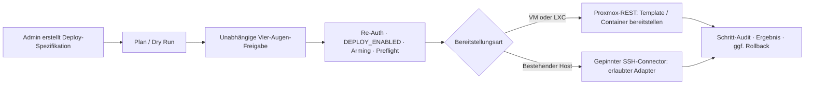

# Deployment Center — kontrollierte Infrastruktur-Bereitstellung

**Status:** Im Nexora-Backend und in der Admin-Oberfläche implementiert. Das Deployment Center ist standardmäßig nicht scharfgeschaltet und benötigt vor einem Produktionseinsatz eine zielsystembezogene Inbetriebnahme.

Das Deployment Center ist die kontrollierte Bereitstellungsfunktion von Nexora. Es erstellt Infrastruktur aus vorbereiteten, versionierten Vorgaben und installiert ausgewählte Agenten oder Kollektoren auf bekannten Zielsystemen. Es ist **keine** freie Remote-Shell, kein allgemeines Hypervisor-Management und kein Ersatz für einen Change-Management-Prozess.

> **Betriebsgrundsatz:** Ein Plan verändert nichts. Eine echte Änderung ist nur nach unabhängiger Freigabe, frischer Passwortbestätigung, aktivierter Betriebsfreigabe und erfolgreichen Prüfungen möglich.

## Ablauf

## Unterstützte Bereitstellungspfade

Nexora verwendet einen Code-Katalog (Allowlist). Unbekannte Module, Connectoren oder Adapter werden abgewiesen; Modulcode wird nicht dynamisch geladen oder ausgeführt.

| Pfad | Aktuell vorgesehene Module | Kontrollierter Ausführungsweg |
|---|---|---|
| Neue Infrastruktur | OPNsense-Firewall, Rocky-Linux-Container, Windows-Server-VM | Proxmox-REST mit vorbereitetem Golden Template bzw. LXC-Template, Ressourcen- und Netzvorgaben |
| Bestehende Linux-/Windows-Endpunkte | Wazuh-Agent auf Linux oder Windows | explizit konfigurierter SSH-Connector mit erlaubtem Installationsadapter |
| Datenebene | Firewall-Collector, SIEM-Collector, Suricata-IDS-Sensor | explizit konfigurierter SSH-Connector; Collector-Artefakte mit verpflichtender SHA-256-Prüfsumme |

Der VM-/LXC-Pfad verwendet die Proxmox-API und keine beliebige Shell auf dem Hypervisor. Beim Brownfield-Pfad ist SSH bewusst nur für die erlaubten Installationsadapter vorgesehen. Er bleibt ohne vollständig konfigurierten SSH-Connector fail-closed: Keine Verbindung und keine Remote-Ausführung.

## Sicherheits- und Freigabegates

- **RBAC:** Alle Deployment-Endpunkte und die Oberfläche sind auf Administratoren beschränkt.
- **Plan vor Apply:** Der Plan prüft Vorgaben und Voraussetzungen. Bei Agenteninstallationen erzeugt der Plan keine SSH-Verbindung und führt nichts aus.
- **Vier-Augen-Prinzip:** Die Person, die den Lauf erzeugt hat, kann ihn nicht selbst freigeben.
- **Step-up-Authentifizierung:** Connector-Anlage, Schlüsselerzeugung, Betriebsfreigabe und Apply benötigen eine frische Passwortbestätigung.
- **Doppelte Betriebsfreigabe:** `DEPLOY_ENABLED` ist standardmäßig deaktiviert. Zusätzlich wird ein separater Laufzeit-Arming-Schritt verlangt. Ohne beide Freigaben bleibt Apply gesperrt.
- **Netzwerk- und Geheimnisschutz:** Erlaubte Hypervisor-Ziele werden über eine Host-Allowlist begrenzt. Für gespeicherte Connector-Geheimnisse ist ein separater, ausreichend starker Verschlüsselungsschlüssel erforderlich; SSH-Schlüssel und Passphrasen werden verschlüsselt gespeichert. Zertifikate und SSH-Host-Keys können vorab geprüft bzw. gepinnt werden.
- **Nachvollziehbarkeit:** Spezifikationen, Pläne, Freigaben, Ausführungsschritte, Fehler und Rollback-Ergebnisse werden auditiert. Geheimnisse gehören nicht in die Deploy-Spezifikation.

## Sicherer Betriebsablauf

1. Ein Administrator hinterlegt einen geprüften Connector und erfasst das Zertifikat bzw. den SSH-Host-Key.
2. Er wählt ein freigegebenes Modul und ein vorbereitetes Ziel, erzeugt daraus eine Deploy-Spezifikation und führt einen Plan aus.
3. Eine zweite berechtigte Person bewertet den Plan und gibt ihn frei.
4. Erst im freigegebenen Wartungsfenster wird die Betriebsfreigabe aktiviert, der Preflight geprüft und Apply mit frischer Re-Authentifizierung ausgeführt.
5. Das Team prüft Ergebnis und Audit-Trail; bei einem fehlgeschlagenen, rückrollbaren Lauf folgt der dokumentierte Rollback.

## Voraussetzungen für eine produktive Inbetriebnahme

Vor der Verwendung in einer Unternehmensumgebung müssen Betreiber mindestens folgende Punkte verbindlich festlegen und testen:

- Golden Templates/LXC-Templates, Versionierung, Patch-Stand und Eigentümerschaft;
- Proxmox-API-Rollen, erlaubte Hypervisor-Ziele, Netzsegmente, VLANs, Firewall-Regeln und DNS;
- sichere Ablage und Rotation der Connector-Zugangsdaten sowie Prüfung der Zertifikate und Host-Keys;
- Change-Fenster, Vier-Augen-Freigabe, Rückfallplan, Alarmierung und Aufbewahrung der Auditdaten;
- Tests im Staging mit realistischen Fehlerfällen, insbesondere Kapazitätsmangel, falschem Template, Netzwerkfehler und Rollback.

## Bewusste Grenzen

- Das Deployment Center ersetzt keine CMDB, kein ITSM-Freigabeverfahren und kein Patch-Management.
- Es stellt nur die im Katalog freigegebenen Module bereit; es gibt keine Oberfläche für beliebige Skripte oder beliebige externe URLs.
- Ein implementierter Ablauf ist noch keine Betriebsfreigabe für jedes Zielsystem. Die produktive Eignung hängt von den geprüften Templates, Netz- und Berechtigungsmodellen sowie den organisatorischen Kontrollen des Betreibers ab.
- Geplante oder konzeptionelle Erweiterungen, beispielsweise weitere Hypervisoren, sind erst nach Implementierung, Test und dokumentierter Freigabe als verfügbar zu behandeln.

## Schnittstellen im Überblick

Die Admin-API stellt unter `/api/v1/deploy` unter anderem Module, Connectoren, Zertifikats- und Host-Key-Prüfungen, Spezifikationen, Pläne, Freigaben, Apply-Läufe, Auditdaten, Preflight sowie Arming/Disarming bereit. Die genaue technische Architektur und die ursprünglichen Entwurfsüberlegungen sind in [Deployment-Center-Architektur](../01-architecture/deployment-center-architecture.md) beschrieben; diese Seite ist die aktuelle Betriebsübersicht.
