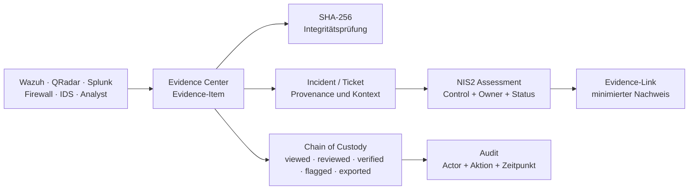

# Nexora — NIS2, Evidence Center und Datenschutz

**Stand:** 04.08.2026  
**Zweck:** Transparente Beschreibung der vorhandenen Funktionen, ihrer Schutzwirkung und der
verbleibenden Betreiberpflichten für einen Enterprise-Einsatz.

> **Verbindliche Einordnung:** Nexora unterstützt Arbeitsabläufe, Nachweisführung und technische
> Schutzmaßnahmen. Es ist **kein NIS2-Konformitätsnachweis, keine Zertifizierung, kein
> Rechtsgutachten und keine pauschale DSGVO-Konformitätszusage.** Ob ein konkreter ATOS-Einsatz
> rechtskonform ist, hängt zusätzlich von Zweck, Rechtsgrundlage, Konfiguration, Verträgen,
> TOMs und Betrieb ab.

---

## 1. Kurzüberblick

Nexora unterstützt drei zusammenhängende Aufgaben:

1. **NIS2-Readiness:** Maßnahmen bewerten, Verantwortliche und Fälligkeiten führen, Nachweise
   verlinken und Review-Bedarf sichtbar machen.
2. **Evidence Center:** technische Belege zu Incidents nachvollziehbar erfassen, auf Integrität
   prüfen und die Bearbeitung als Chain of Custody protokollieren.
3. **Datenschutz by Design:** Datenminimierung in NIS2-Referenzen, Zugriffsschutz, redigierte
   Audit-Metadaten sowie sichere Default-Einstellungen unterstützen.

## 2. NIS2-Readiness: Was Nexora heute leistet

Nexora führt einen statischen, versionierten Katalog mit zehn
Risikomanagement-Maßnahmenbereichen. Für jeden Control kann ein Assessment mit Verantwortlichen,
Fälligkeit, Notizen, Bearbeitungsstatus und mehreren Evidence-Links angelegt werden.

| Element | Funktion |
|---|---|
| Control-Katalog | Versionierte, stabile Control-Keys; die Definitionen liegen im Code und nicht in einer frei veränderbaren Datenbanktabelle. |
| Assessment | Ein Arbeitsstand pro Control: `not_started`, `in_progress`, `evidence_collected`, `needs_review`, `addressed` oder `not_applicable`. |
| Evidence-Link | Verknüpfung zu Ticket, Audit-Event, Node, Integration, GitOps-Profil, Dokument oder externer Referenz. |
| Signale | `overdue`, `missingEvidence`, `needsReview` und `reviewDue` machen fehlende bzw. veraltete Nachweise sichtbar. |
| Management-Report | Stellt den Arbeits- und Nachweisstand dar und enthält einen sichtbaren Disclaimer. |
| Rollen | Lesen ab `viewer`; Änderungen an Assessments und Evidence-Links nur für `admin`. |

Ein Control mit Status `addressed`, aber ohne Evidence, wird bewusst weiter als
`needsReview` signalisiert. Das verhindert, dass ein Statuswort fälschlich als Nachweis oder
als Rechtskonformität interpretiert wird. Ein Status `not_applicable` verlangt eine Begründung.
Der Standard-Review-Zyklus ist konfigurierbar und liegt aktuell bei 365 Tagen.

### 2.1 Sicherheit der NIS2-Nachweise

- Evidence-Referenzen akzeptieren nur `http`/`https`; `javascript:`, `data:`, `file:` und
  vergleichbare Schemata werden abgelehnt.
- URLs mit eingebetteten Zugangsdaten, Secret-artigen Query-/Fragment-Parametern oder
  Steuerzeichen werden abgelehnt.
- Freitextfelder lehnen HTML-/Steuerzeichen ab; das Frontend rendert keinen unbereinigten
  HTML-Input.
- Audit-Einträge zu NIS2 speichern nur sichere Metadaten, etwa Control-Key, IDs, Status und
  Evidence-Typ — nicht Notes, URLs, Titel, Beschreibungen oder Evidence-Inhalte.
- Wird ein Incident als NIS2-Nachweis verknüpft, erzeugt Nexora einen sicheren Snapshot ohne
  E-Mail-Adresse, Benutzername oder IP-Adresse.

### 2.2 Was NIS2-Readiness ausdrücklich nicht leistet

Nexora entscheidet nicht, ob ATOS in den Anwendungsbereich fällt, welche nationale Umsetzung
gilt oder ob alle organisatorischen Maßnahmen wirksam sind. Die NIS2-Richtlinie verlangt
angemessene und verhältnismäßige technische, operative und organisatorische Maßnahmen;
Management-Verantwortung und deren Umsetzung bleiben bei der jeweiligen Organisation.
[NIS2-Richtlinie, Artikel 20–21](https://eur-lex.europa.eu/eli/dir/2022/2555/oj/eng)

## 3. Evidence Center und Chain of Custody

Ein Evidence-Item gehört zu einem Ticket und enthält Kontext wie Typ, Quelle, Titel,
Log-/Event-Referenz, Zeitstempel, Analystenkommentar und optionalen Rohtext. Unterstützte Typen
umfassen beispielsweise Log-Eintrag, Netzwerkfluss, Prozess, Datei, Registry, DNS, E-Mail,
Screenshot, Threat Intel, Hunt Finding und KI-Ausgabe.

### 3.1 Integrität und Nachvollziehbarkeit

- Beim Erzeugen berechnet Nexora einen SHA-256-Wert über den unveränderlichen fachlichen Inhalt
  des Evidence-Items.
- Beim Evidence-Export wird die Integrität jedes Items erneut geprüft.
- Zu jedem Item können Custody-Ereignisse `viewed`, `reviewed`, `verified`, `flagged`, `note`
  und `exported` erfasst werden.
- Ein Export erzeugt pro enthaltenem Item ein `exported`-Custody-Ereignis sowie einen Audit-Eintrag
  mit Actor, Zeitpunkt, Anzahl der Items und Ergebnis der Integritätsprüfung.
- Die Anwendungs-API bietet für Evidence keine Update- oder Delete-Operation; die Bearbeitung
  ergänzt Ereignisse, statt Belege still zu überschreiben.

**Wichtige Grenze:** Ein SHA-256-Hash erkennt eine Änderung am gespeicherten Inhalt. Er beweist
aber nicht automatisch Herkunft, Vollständigkeit, rechtliche Beweiskraft oder die Unveränderbarkeit
bei privilegiertem Datenbankzugriff. Für forensisch oder rechtlich besonders kritische Belege
braucht der Betreiber zusätzlich rollengetrennte Datenbankadministration, Backup-/Restore-Prozesse,
Aufbewahrungsregeln und gegebenenfalls WORM-/Signatur- oder externes Archivverfahren.

### 3.2 Dateiuploads und Schutzgrenzen

Dateiimporte werden im aktuellen Stand direkt in der Datenbank als Inhalt abgelegt. Erlaubt sind
`.txt`, `.log`, `.json`, `.csv` und `.pdf`; die maximale Größe beträgt 5 MB. Das reduziert die
Angriffsfläche, ersetzt aber **keinen** Malware-Scan, keine Inhaltsklassifikation und keine
datenschutzrechtliche Freigabe. Für einen Enterprise-Betrieb sind vorgelagerter Scan,
MIME-/Inhaltsprüfung, Größen-/Quota-Regeln und eine Retention-Policy erforderlich.

## 4. Datenschutz: unterstützende Maßnahmen und Grenzen

Security-Telemetrie kann personenbezogene Daten enthalten — zum Beispiel Benutzerkennungen,
E-Mail-Adressen, IP-Adressen im jeweiligen Kontext, Hostnamen, Kommandozeilen oder Inhalte von
E-Mail-Evidence. Nexora behandelt diese Daten nicht automatisch als anonym.

| Datenschutzprinzip / Schutzbedarf | Vorhandene Unterstützung in Nexora | Betreiberpflicht im ATOS-Einsatz |
|---|---|---|
| Datenminimierung | NIS2-Incident-Snapshot ohne PII; Audit speichert bei NIS2 nur sichere Metadaten. | Festlegen, welche Felder je Quelle tatsächlich benötigt und übernommen werden. |
| Zugriffskontrolle | Authentifizierung, RBAC, Cookie-/CSRF-Schutz; NIS2-Schreiben nur admin. | Rollenmodell, Mandantentrennung, Berechtigungsreviews und MFA organisatorisch erzwingen. |
| Integrität/Nachvollziehbarkeit | SHA-256, Custody, Audit, append-only Anwendungsablauf. | DB-/Backup-Schutz, Admin-Trennung, Monitoring und Incident-Response betreiben. |
| Vertraulichkeit | Secrets nicht in NIS2-Links; Cloud-KI opt-in; Security-Gates standardmäßig aus. | TLS, Verschlüsselung at rest, Schlüsselverwaltung, Netzsegmentierung und Drittlandtransfer bewerten. |
| Speicherbegrenzung | Derzeit kein globaler, automatisch erzwungener Retention-/Löschworkflow für Evidence. | Löschkonzept, Aufbewahrungsfristen, Legal Hold und DSAR-Prozesse definieren und implementieren. |
| Transparenz/Rechtsgrundlage | Keine automatische Bestimmung einer Rechtsgrundlage. | Verzeichnis der Verarbeitungstätigkeiten, Zweck, Rechtsgrundlage, Informationspflichten und Rollen Controller/Processor festlegen. |

Die DSGVO verlangt unter anderem rechtmäßige, zweckgebundene und auf das notwendige Maß begrenzte
Verarbeitung sowie geeignete technische und organisatorische Maßnahmen. Die Bewertung muss für
den konkreten Einsatz erfolgen. [DSGVO — Verordnung (EU) 2016/679](https://eur-lex.europa.eu/eli/reg/2016/679/oj/eng)

## 5. Vor dem produktiven ATOS-Einsatz verbindlich zu entscheiden

1. **Zweck und Rechtsgrundlage:** Welche SOC-Prozesse verarbeitet Nexora und auf welcher
   Rechtsgrundlage?
2. **Rollenmodell:** Ist ATOS Verantwortlicher, Auftragsverarbeiter oder gemeinsam
   Verantwortlicher — je Datenfluss und Mandant?
3. **Datenkatalog:** Welche Events, Evidence-Typen und Felder dürfen in Nexora gespeichert werden?
4. **Retention und Löschung:** Fristen, Legal Hold, Backup-Löschung, Export sowie Umgang mit
   Betroffenenanfragen.
5. **TOMs:** TLS, Verschlüsselung at rest, Schlüsselmanagement, Backup, Restore-Test,
   Netzsegmentierung, Monitoring, Patch- und Vulnerability-Management.
6. **DSFA-Prüfung:** Datenschutzbeauftragte und Legal bewerten, ob eine
   Datenschutz-Folgenabschätzung erforderlich ist.
7. **Externe Anbieter:** Cloud-LLM, Threat-Intel und ITSM/SIEM-Datenflüsse nur nach
   Datenschutz-, Sicherheits- und Vertragsfreigabe aktivieren.

## 6. Abnahmecheckliste für einen Pilot

- [ ] NIS2-Controls, Owner, Fälligkeiten und Evidence-Links wurden mit dem Fachbereich geprüft.
- [ ] Ein `addressed`-Control ohne Evidence wird im Management-Report sichtbar als Review-Bedarf.
- [ ] Rollen für viewer, analyst, engineer und admin wurden getestet.
- [ ] Evidence-Export protokolliert Custody und Audit; Integritätsprüfung wird kontrolliert.
- [ ] Keine Secrets, Zugangsdaten oder unnötigen PII in Evidence-Links oder Audit-Metadaten.
- [ ] Lösch-, Retention-, Backup- und Legal-Hold-Konzept ist dokumentiert und getestet.
- [ ] TOMs, AVV/Verträge, Datenresidenz und gegebenenfalls DSFA sind freigegeben.
- [ ] Cloud-Provider bleiben deaktiviert, bis Datenfluss und Freigabe vorliegen.

## 7. Fazit

Nexora liefert konkrete technische Bausteine für NIS2-Nachweisführung, Evidence-Integrität,
Auditierbarkeit und Datenschutz by Design. Die Plattform verkürzt und strukturiert den Weg zur
Compliance-Arbeit; sie nimmt der Betreiberorganisation jedoch nicht die rechtliche Bewertung,
die organisatorischen Maßnahmen oder die Verantwortung für den tatsächlichen Betrieb ab.
