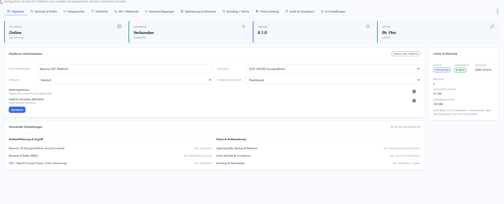

# Allgemein & Lizenz

**Menü:** Systemeinstellungen → Tab **Allgemein**

!!! note "Rolle"
    Ändern nur als **admin**. Andere Rollen sehen die Werte read-only.

## Statuskacheln (oben)

Vier Live-Kacheln zeigen den Betriebszustand:

- **API-Status** — z. B. `Online` (Dienstname `soc-ticket-api`).
- **Datenbank** — z. B. `Verbunden` (PostgreSQL).
- **Version** — aktuelle Plattformversion (z. B. `0.1.0`).
- **Uptime** — Laufzeit seit dem letzten Start.

## Plattform-Informationen

| Feld | Bedeutung |
|---|---|
| **Plattformname** | Anzeigename der Instanz (z. B. „Nexora SOC Platform"). Wirkt auf Titel/Branding. |
| **Zeitzone** | Basis für alle Zeitangaben in der UI (z. B. `(UTC+02:00) Europe/Berlin`). |
| **Sprache** | Standardsprache der Oberfläche (Deutsch). |
| **Standard-Ansicht** | Startseite nach dem Login (z. B. `Dashboard`). |

### Schalter

- **Wartungsmodus** — sperrt die Plattform für normale Benutzer (HTTP **503**); Admins behalten
  Zugriff. Für Updates/Wartungsfenster.
- **Feature-Vorschau aktivieren** — schaltet Beta-Funktionen frei.

Mit **Speichern** übernehmen.

## Lizenz & Nutzung (rechts)

Zeigt **echte Werte aus der Datenbank** — keine künstliche Nutzer- oder Speichergrenze in der
Community-Edition:

- **Edition / Lizenzstatus / Gültig bis** — z. B. `Community` · `Aktiv` · `Open Source`.
- **Benutzer** — Anzahl angelegter Konten.
- **Datensätze gesamt** — Summe aller Einträge.
- **Datenbankgröße** — tatsächliche DB-Größe auf Disk.

## Verwandte Einstellungen

Der untere Block „Verwandte Einstellungen" verlinkt in die passenden Tabs — nützlich als
Wegweiser:

- Passwort-/Sitzungsrichtlinie, Account-Lockout → [Sicherheit](sicherheit.md)
- Benutzer & Rollen (RBAC) → [Benutzer & Rollen](benutzer-rollen.md)
- SSO / OpenID Connect → [Sicherheit](sicherheit.md)
- Speichergröße, Backup & Retention → [Speicherung & Retention](speicherung-retention.md)
- Audit-Aktivität & Compliance → [Audit & Compliance](audit-compliance.md)
- Branding & Akzentfarbe → [Branding & Thema](branding.md)
