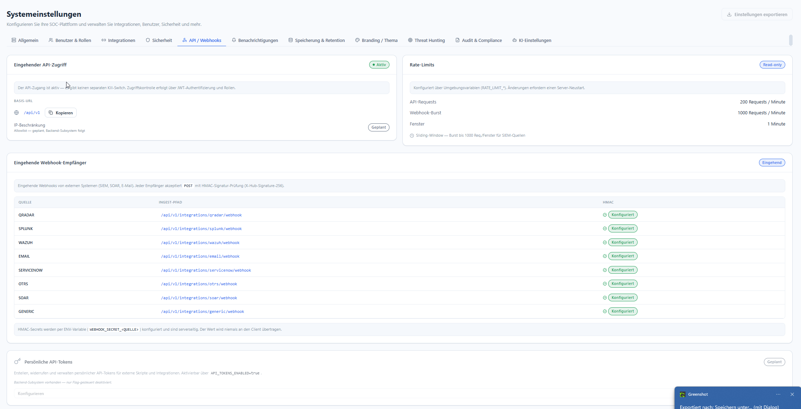

# API & Webhooks

**Menü:** Systemeinstellungen → Tab **API / Webhooks**

!!! note "Rolle"
    Read-only-Übersicht; Rate-Limits und Secrets werden serverseitig über ENV-Variablen gesetzt.

## Eingehender API-Zugriff

- Der API-Zugang ist **aktiv** — es gibt **keinen separaten Kill-Switch**. Zugriffskontrolle
  erfolgt über **JWT-Authentifizierung und Rollen**.
- **Basis-URL** — `/api/v1` (per Button kopierbar).
- **IP-Beschränkung** — Allowlist ist *geplant* (Backend-Subsystem folgt).

## Rate-Limits *(read-only)*

Konfiguriert über Umgebungsvariablen `RATE_LIMIT_*`. **Änderungen erfordern einen Server-Neustart.**

| Limit | Wert |
|---|---|
| **API-Requests** | 200 Requests / Minute |
| **Webhook-Burst** | 1000 Requests / Minute |
| **Fenster** | 1 Minute (Sliding-Window; Burst bis 1000 Req./Fenster für SIEM-Quellen) |

## Eingehende Webhook-Empfänger

Externe Systeme (SIEM, SOAR, E-Mail) senden per **POST**. Jeder Empfänger prüft eine
**HMAC-Signatur** (`X-Hub-Signature-256`).

| Quelle | Ingest-Pfad |
|---|---|
| QRADAR | `/api/v1/integrations/qradar/webhook` |
| SPLUNK | `/api/v1/integrations/splunk/webhook` |
| WAZUH | `/api/v1/integrations/wazuh/webhook` |
| EMAIL | `/api/v1/integrations/email/webhook` |
| SERVICENOW | `/api/v1/integrations/servicenow/webhook` |
| OTRS | `/api/v1/integrations/otrs/webhook` |
| SOAR | `/api/v1/integrations/soar/webhook` |
| GENERIC | `/api/v1/integrations/generic/webhook` |

!!! warning "HMAC-Secrets"
    Secrets werden pro Quelle über die ENV-Variable `WEBHOOK_SECRET_<QUELLE>` gesetzt, sind
    serverseitig und werden **niemals an den Client** übertragen. Zusätzlich schützt ein
    Nonce-basierter Replay-Schutz (5-Minuten-Fenster).

## Persönliche API-Tokens *(geplant)*

Erstellen, widerrufen und verwalten persönlicher API-Tokens für externe Skripte/Integrationen.
Das Backend-Subsystem ist vorhanden, aber flag-gesteuert deaktiviert — aktivierbar über
`API_TOKENS_ENABLED=true`.
