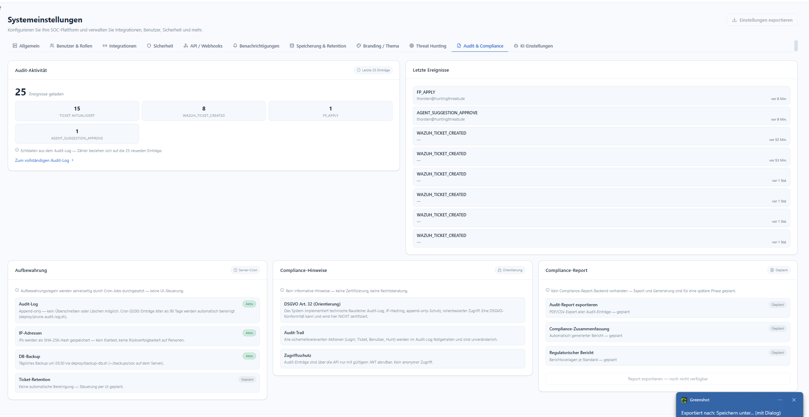

# Audit & Compliance

**Menü:** Systemeinstellungen → Tab **Audit & Compliance**

!!! note "Rolle"
    Audit-Aktivität ist für **admin** einsehbar; das vollständige Audit-Log hat eine eigene Seite
    ([Audit-Log](../02-user-guide/pages/AuditLog.md)).

## Audit-Aktivität

Zeigt die neuesten Ereignisse als **Echtdaten aus dem Audit-Log** (die Zähler beziehen sich auf
die 25 neuesten Einträge), z. B. `TICKET_AKTUALISIERT`, `WAZUH_TICKET_CREATED`, `FP_APPLY`,
`AGENT_SUGGESTION_APPROVE`. Rechts stehen die **letzten Ereignisse** mit Actor und Zeit.
Über **„Zum vollständigen Audit-Log"** geht es in die durchsuchbare Gesamtansicht (mit CSV-Export).

## Aufbewahrung *(Server-Cron)*

| Baustein | Status | Details |
|---|---|---|
| **Audit-Log** | Aktiv | Append-only — kein Überschreiben/Löschen. Cron 02:00 bereinigt Einträge > 90 Tage (`deploy/prune-audit-log.sh`). |
| **IP-Adressen** | Aktiv | Als **SHA-256-Hash** gespeichert — kein Klartext, keine Rückverfolgbarkeit auf Personen. |
| **DB-Backup** | Aktiv | Täglich 03:30 via `deploy/backup-db.sh`. |
| **Ticket-Retention** | Geplant | Keine automatische Bereinigung — Steuerung per UI geplant. |

## Compliance-Hinweise *(Orientierung)*

!!! warning "Keine Zertifizierung, keine Rechtsberatung"
    Rein informative Hinweise. Das System implementiert **technische Bausteine** (Audit-Log,
    IP-Hashing, Append-only-Schutz, rollenbasierter Zugriff). Eine DSGVO-Konformität kann und
    wird hier **NICHT** zertifiziert.

- **DSGVO Art. 32 (Orientierung)** — technische Maßnahmen sind umgesetzt, ohne Konformitätsanspruch.
- **Audit-Trail** — alle sicherheitsrelevanten Aktionen (Login, Ticket, Benutzer, Hunt) sind
  unveränderlich protokolliert.
- **Zugriffsschutz** — Audit-Einträge nur über die API mit gültigem JWT abrufbar; kein anonymer Zugriff.

## Compliance-Report *(geplant)*

Export und Generierung sind für eine spätere Phase geplant: **Audit-Report exportieren**
(PDF/CSV), **Compliance-Zusammenfassung** (automatisch generiert), **Regulatorischer Bericht**
(Vorlagen je Standard).
