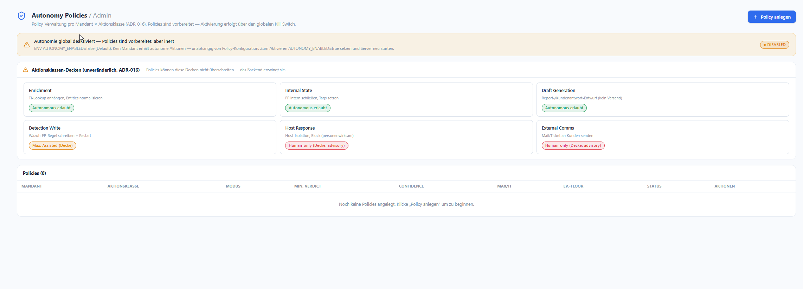
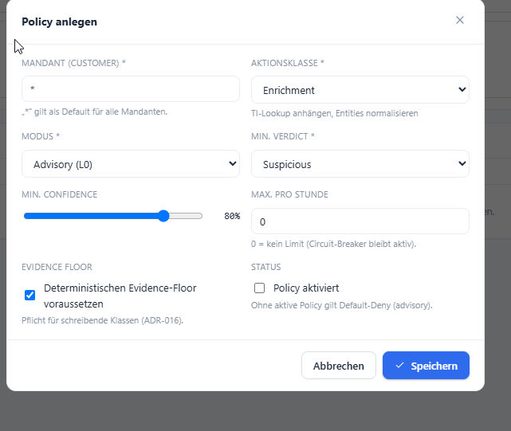

# Autonomie-Richtlinien

**Menü:** Autonomy Policies (Admin)

!!! danger "Global per Kill-Switch gesperrt"
    Autonomie ist **global deaktiviert** (`AUTONOMY_ENABLED=false`, Default). Policies lassen sich
    zwar vorbereiten, bleiben aber **inert** — kein Mandant erhält autonome Aktionen, unabhängig
    von der Policy-Konfiguration. Zum Aktivieren `AUTONOMY_ENABLED=true` setzen und den Server neu
    starten.

Policies werden **pro Mandant × Aktionsklasse** verwaltet (ADR-016).

## Aktionsklassen-Decken *(unveränderlich)*

Jede Aktionsklasse hat eine **Decke**, die eine Policy **nicht überschreiten** kann — das Backend
erzwingt sie:

| Aktionsklasse | Beispiel | Decke |
|---|---|---|
| **Enrichment** | TI-Lookup anhängen, Entities normalisieren | Autonomous erlaubt |
| **Internal State** | FP intern schließen, Tags setzen | Autonomous erlaubt |
| **Draft Generation** | Report-/Kundenantwort-Entwurf (kein Versand) | Autonomous erlaubt |
| **Detection Write** | Wazuh-FP-Regel schreiben + Restart | Max. **Assisted** |
| **Host Response** | Host-Isolation, Block (personenwirksam) | **Human-only** (advisory) |
| **External Comms** | Mail/Ticket an Kunden senden | **Human-only** (advisory) |

## Policy anlegen

| Feld | Bedeutung |
|---|---|
| **Mandant (Customer)** | Ziel-Mandant; `*` gilt als Default für alle Mandanten. |
| **Aktionsklasse** | eine der sechs Klassen (siehe oben). |
| **Modus** | z. B. `Advisory (L0)` — Autonomiestufe. |
| **Min. Verdict** | Mindest-Verdikt, ab dem die Policy greift (z. B. `Suspicious`). |
| **Min. Confidence** | Mindest-Konfidenz (Slider, z. B. 80 %). |
| **Max. pro Stunde** | Rate-Limit; `0` = kein Limit (Circuit-Breaker bleibt aktiv). |
| **Evidence Floor** | „Deterministischen Evidence-Floor voraussetzen" — **Pflicht** für schreibende Klassen (ADR-016). |
| **Status** | Policy aktiviert? Ohne aktive Policy gilt **Default-Deny (advisory)**. |

!!! info "Sicheres Standardverhalten"
    Ohne aktive Policy = Default-Deny. Schreibende/personenwirksame Klassen sind per Decke auf
    *advisory* begrenzt — selbst wenn der globale Kill-Switch später aktiviert würde.
