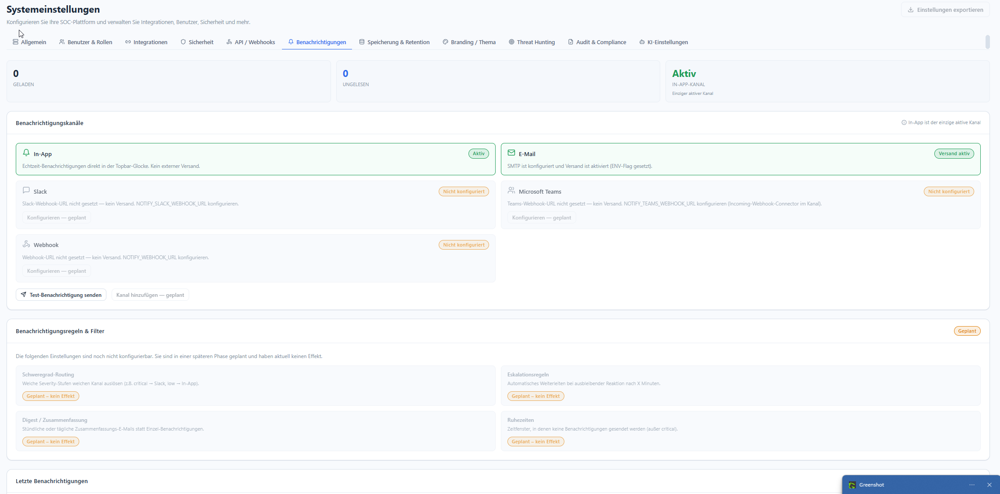

# Benachrichtigungen

**Menü:** Systemeinstellungen → Tab **Benachrichtigungen**

!!! note "Rolle"
    Kanäle konfigurieren nur **admin**. Endpunkte werden über ENV-Variablen gesetzt.

## Kanäle

Oben stehen Zähler (`Geladen` / `Ungelesen`) und der aktuell aktive Kanal.

| Kanal | Status / Aktivierung |
|---|---|
| **In-App** | Echtzeit-Benachrichtigungen direkt in der Topbar-Glocke. Kein externer Versand. Standardmäßig aktiv. |
| **E-Mail** | Versand über SMTP; aktiv, wenn SMTP konfiguriert **und** das ENV-Flag gesetzt ist. |
| **Slack** | *Nicht konfiguriert* — `NOTIFY_SLACK_WEBHOOK_URL` setzen. |
| **Microsoft Teams** | *Nicht konfiguriert* — `NOTIFY_TEAMS_WEBHOOK_URL` (Incoming-Webhook-Connector). |
| **Webhook** | *Nicht konfiguriert* — `NOTIFY_WEBHOOK_URL` setzen. |

Mit **Test-Benachrichtigung senden** lässt sich der aktive Kanal prüfen.

## Benachrichtigungsregeln & Filter *(geplant, aktuell ohne Effekt)*

Diese Einstellungen sind für eine spätere Phase vorgesehen und haben derzeit **keinen** Effekt:

- **Schweregrad-Routing** — welche Severity welchen Kanal auslöst (z. B. `critical → Slack`, `low → In-App`).
- **Eskalationsregeln** — automatisches Weiterleiten bei ausbleibender Reaktion nach X Minuten.
- **Digest / Zusammenfassung** — stündliche/tägliche Sammel-E-Mails statt Einzelmeldungen.
- **Ruhezeiten** — Zeitfenster ohne Benachrichtigungen (außer `critical`).

!!! info "Ehrliche Kennzeichnung"
    Geplante Funktionen sind in der UI klar als *„Geplant – kein Effekt"* markiert — sie zeigen
    nie Fake-Daten oder eine scheinbare Wirkung.
