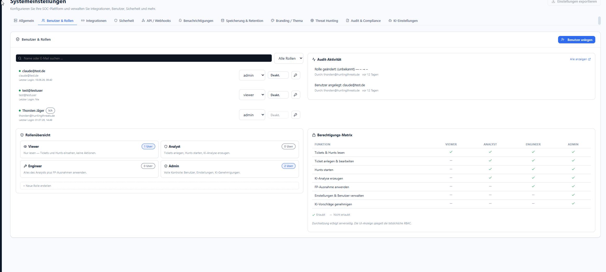

# Benutzer & Rollen (RBAC)

**Menü:** Systemeinstellungen → Tab **Benutzer & Rollen**

!!! note "Rolle"
    Benutzer anlegen, Rollen ändern, deaktivieren und Passwörter zurücksetzen darf nur **admin**.

## Benutzer verwalten

- **Benutzer anlegen** (oben rechts) — legt ein neues Konto an. Neue Konten erhalten die
  gewählte Rolle; SSO-Neuzugänge bekommen die Standardrolle (kein Auto-Admin).
- **Suche & Rollenfilter** — Liste nach Name/E-Mail durchsuchen, nach Rolle filtern.
- Je Benutzerzeile:
    - **Rollen-Dropdown** — Rolle direkt ändern (`viewer` / `analyst` / `engineer` / `admin`).
    - **Deakt.** — Konto deaktivieren (sperrt den Login, ohne zu löschen).
    - **🔑 Schlüssel-Symbol** — Passwort-Reset für dieses Konto auslösen.
    - Anzeige von **letztem Login**.

Jede Änderung erscheint rechts in der **Audit-Aktivität** (wer hat wann welche Rolle geändert /
welches Konto angelegt).

## Rollenübersicht

Vier eingebaute Rollen mit klarer Hierarchie **admin > engineer > analyst > viewer**:

| Rolle | Kurzbeschreibung |
|---|---|
| **Viewer** | Nur lesen — Tickets und Hunts einsehen, keine Aktionen. |
| **Analyst** | Tickets anlegen, Hunts starten, KI-Analyse erzeugen. |
| **Engineer** | Alles des Analysten plus **FP-Ausnahmen anwenden**. |
| **Admin** | Volle Kontrolle: Benutzer, Einstellungen, KI-Genehmigungen. |

Über **+ Neue Rolle erstellen** lassen sich weitere Rollen anlegen.

## Berechtigungs-Matrix

| Funktion | viewer | analyst | engineer | admin |
|---|:--:|:--:|:--:|:--:|
| Tickets & Hunts lesen | ✅ | ✅ | ✅ | ✅ |
| Ticket anlegen & bearbeiten | — | ✅ | ✅ | ✅ |
| Hunts starten | — | ✅ | ✅ | ✅ |
| KI-Analyse erzeugen | — | ✅ | ✅ | ✅ |
| FP-Ausnahme anwenden | — | — | ✅ | ✅ |
| Einstellungen & Benutzer verwalten | — | — | — | ✅ |
| KI-Vorschläge genehmigen | — | ✅ | ✅ | ✅ |

!!! warning "Durchsetzung serverseitig"
    Die UI-Anzeige spiegelt nur die tatsächliche RBAC. **Durchgesetzt wird serverseitig**
    (`authenticate.js` + `requireRole(...)` je Route) — ein ausgeblendeter Button ist zusätzlich
    auch am Endpunkt gesperrt.
