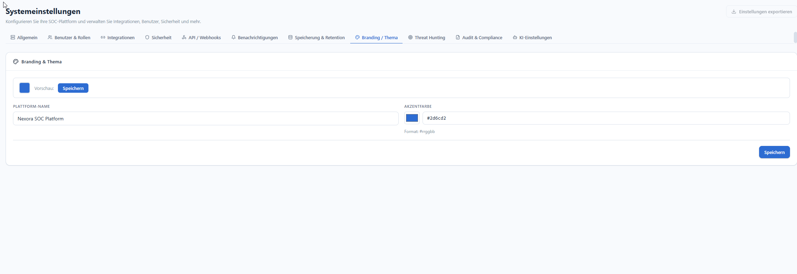

# Branding & Thema

**Menü:** Systemeinstellungen → Tab **Branding / Thema**

!!! note "Rolle"
    Nur **admin**.

Zwei Einstellungen mit Live-**Vorschau**:

| Feld | Bedeutung |
|---|---|
| **Plattform-Name** | Anzeigename der Instanz (z. B. „Nexora SOC Platform"). |
| **Akzentfarbe** | Primärfarbe der UI im Format `#rrggbb` (z. B. `#2d6cd2`). |

Die Vorschau links zeigt die Akzentfarbe sofort; mit **Speichern** wird sie übernommen.

!!! info "Farben konsequent über Variablen"
    Die UI verwendet die Akzentfarbe über CSS-Variablen (Dark/Light) — es gibt keine
    hartkodierten Hex-Werte in den Komponenten. Deshalb wirkt die Änderung global.
