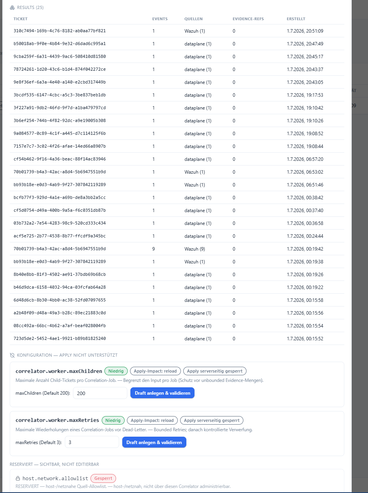

# Correlation Engine

**Menü:** Korrelatoren → Detailansicht **Correlation Engine**

!!! note "Rein lesend + Apply gesperrt"
    Die Engine verknüpft Daten asynchron; die UI **liest** nur das materialisierte Ergebnis. Der
    Apply-Kanal ist serverseitig gesperrt (`CONFIG_APPLY_ENABLED=false`).

## Zweck & Ein-/Ausgaben

Asynchrone, materialisierte Korrelation: *Ticket/Evidence/Flow geändert → persistenter
Correlation-Job → Worker → materialisiertes Result, das die UI nur liest.* **Kein SIEM-/EDR-Ersatz,
keine Bedrohungsentfernung.**

- **Engine-Version** — z. B. `ce-3`.
- **Inputs** — `ticket`, `child-ticket`, `evidence`.
- **Outputs** — `correlated-evidence`.
- **Status-Herkunft** — aus Job-Daten abgeleitet (live).
- **Zähler** — *aktiv / abgeschlossen / fehlgeschlagen / ersetzt*.

## Worker Live-Health

- **Heartbeat** — z. B. *frisch*.
- **Queue** — z. B. *bereit (idle)*.
- **Kill-Switch** — *aus (gesperrt)*.
- **Apply blockiert** — „Apply serverseitig gesperrt (`CONFIG_APPLY_ENABLED=false`)".

## Jobs

Tabelle der letzten Jobs mit **Ticket**, **Status**, **Engine**, **Versuche** und **Erstellt**.

## Konfiguration *(Apply nicht unterstützt)*

Auf der Korrelatoren-Seite lassen sich Config-Werte als **Draft anlegen & validieren** — ein
Scharfschalten ist gesperrt (Apply-Impact: reload, serverseitig gesperrt):

| Schlüssel | Bedeutung |
|---|---|
| `correlator.worker.maxChildren` | Max. Child-Tickets pro Job (Default 200) — Schutz vor unbounded Evidence-Mengen. |
| `correlator.worker.maxRetries` | Max. Wiederholungen vor Dead-Letter (Default 3) — bounded Retries. |
| `host.network.allowlist` | **Reserviert — sichtbar, nicht editierbar** (host-/netznah, nicht über diesen Korrelator administrierbar). |

### Warum ist das Scharfschalten (Apply) gesperrt?

!!! danger "Bewusster Kill-Switch, kein Fehler"
    **Draft anlegen & validieren** ist ungefährlich — es wird nur gelesen und geprüft.
    **Scharfschalten (Apply)** wäre der *erste Punkt, an dem Nexora tatsächlich schreibend auf ein
    laufendes System wirkt*. Genau dieser Schritt bleibt hinter einer harten, standardmäßig
    geschlossenen Sperre (`CONFIG_APPLY_ENABLED=false`).

Die Gründe:

1. **Höchste Risikofläche.** Das Produktprinzip ist read-only / Human-in-the-loop / kein
   Auto-Apply. Ein Kanal, der Config wirklich aktiviert, bekommt deshalb ein default-geschlossenes
   Gate.
2. **Nicht über die UI schaltbar.** Der Flag ist rein server-/deploymentseitig — ein
   kompromittiertes Konto oder eine manipulierte UI kann Apply nicht aktivieren.
3. **Technisch fertig, aber noch nicht freigegeben.** Der Apply-Kanal ist implementiert und
   getestet (fail-closed, atomarer Store-Write, Health-Check, Rollback, `failed_safe_stop`-Alarm,
   Vier-Augen-Freigabe + frische Re-Authentifizierung, append-only Audit). Verbleibendes Gate:
   eine **ausdrückliche menschliche Freigabe** für eine kontrollierte Testumgebung. Bis dahin
   bleibt der Flag in *jeder* echten Umgebung `false`.
4. **Defense-in-Depth selbst bei aktiviertem Switch.** Eligibel sind nur die **zwei typisierten
   Integer-Parameter** (`maxChildren` / `maxRetries`). Alles Host-/Netz-/Firewall-Nahe ist
   *deny by default* — deshalb steht `host.network.allowlist` als „reserviert, gesperrt" daneben.

Vollständiges Bedrohungsmodell und die Invarianten:
[Apply-Channel Threat-Model](../05-security/apply-channel-threat-model.md).

Architektur-Hintergrund: [Korrelations-Datenmodell](../01-architecture/correlation-data-model.md).
