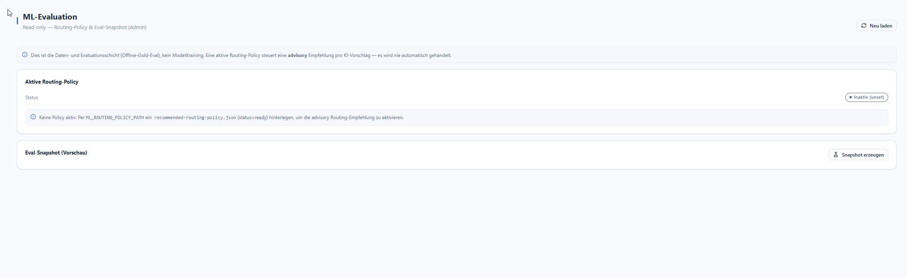

# ML-Evaluation

**Menü:** ML-Evaluation (Admin)

!!! note "Read-only — Daten- & Evaluationsschicht"
    Dies ist die **Offline-Gold-Eval**, **kein** Modelltraining. Eine aktive Routing-Policy steuert
    eine **advisory** Empfehlung pro KI-Vorschlag — es wird **nie automatisch gehandelt**.

## Aktive Routing-Policy

Zeigt den Policy-Status (z. B. *Inaktiv (unset)*). Zum Aktivieren der advisory Routing-Empfehlung
wird per `ML_ROUTING_POLICY_PATH` eine `recommended-routing-policy.json` (`status=ready`)
hinterlegt.

## Eval-Snapshot (Vorschau)

Über **Snapshot erzeugen** wird ein Evaluations-Snapshot als Vorschau erstellt.

!!! info "Hintergrund"
    Details zum Datenvertrag und Vorgehen: [ML-Label-Contract](../01-architecture/ml-label-contract.md),
    [ML-Eval-Schema](../01-architecture/ml-eval-schema.md),
    [Routing-Policy-Runbook](../01-architecture/ml-routing-policy-runbook.md).
