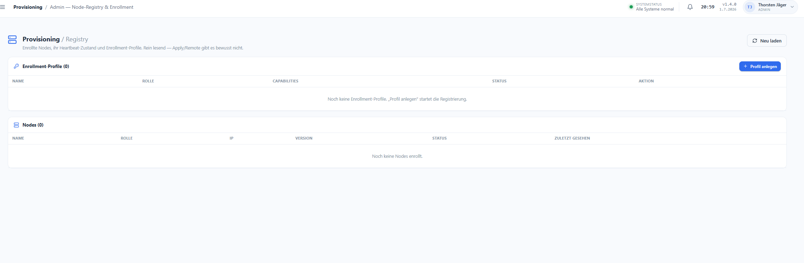
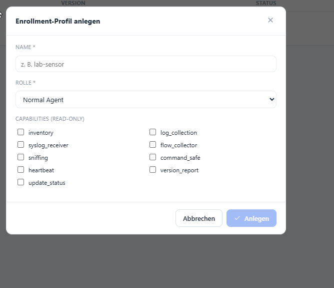

# Provisioning & Enrollment

**Menü:** Provisioning (Admin — Node-Registry & Enrollment)

!!! note "Rein lesend — kein Apply/Remote"
    Die Registry zeigt enrollte Nodes, ihren Heartbeat-Zustand und Enrollment-Profile.
    **Apply/Remote gibt es bewusst nicht** — der Server sendet nie ausführbare Befehle an eine
    Node zurück. Ein Safety-Scanner sichert das im Build ab.

## Enrollment-Profile

Ein Profil beschreibt Rolle + read-only-Capabilities für neue Nodes. **„Profil anlegen"** startet
die Registrierung. Die Tabelle listet Name, Rolle, Capabilities und Status.

| Feld | Bedeutung |
|---|---|
| **Name** | Bezeichner des Profils (z. B. `lab-sensor`). |
| **Rolle** | z. B. `Normal Agent`. |
| **Capabilities (read-only)** | welche Datensammel-Fähigkeiten die Node **deklarieren darf** — siehe Tabelle unten. |

### Was die Capabilities bedeuten

!!! info "Alle Capabilities sind read-only"
    Es handelt sich ausschließlich um **datensammelnde, lesende** Fähigkeiten — **keine
    ausführbare Netz- oder Firewall-Aktion** (`provisioningDomain.js`). Eine Capability *erlaubt*
    und *beschreibt* nur, was eine Node meldet; sie räumt der Node **kein** Recht ein, etwas am
    Zielsystem zu verändern. Auswahl aus einer festen Allowlist — unbekannte Werte werden
    serverseitig abgewiesen.

| Capability | Was sie bedeutet |
|---|---|
| **`inventory`** | Meldet Asset-/Host-Inventar (OS, Hardware, installierte Pakete, Netzwerk-Interfaces). |
| **`log_collection`** | Sammelt lokale Logdateien und leitet sie weiter. |
| **`syslog_receiver`** | Nimmt Syslog anderer Geräte entgegen (Syslog-Listener über UDP/TCP). |
| **`flow_collector`** | Sammelt Netzwerk-Flow-Metadaten (NetFlow/IPFIX/conntrack) — **Flow-Daten, keine Paket-Inhalte**. |
| **`sniffing`** | Passives Mitlesen von Netzwerkverkehr (z. B. Sensor an SPAN/Tap, Suricata) — rein beobachtend. |
| **`command_safe`** | Kennzeichnet, dass die Node ausschließlich **sichere, lesende Kommandos** ausführt (keine Zustandsänderung, kein Remote-Apply). |
| **`heartbeat`** | Sendet periodische Lebenszeichen/Health-Signale an die Registry. |
| **`version_report`** | Meldet die eigene Agent-/Software-Version. |
| **`update_status`** | **Meldet** den Update-/Patch-Zustand — führt selbst **kein** Update aus. |

## Nodes

Zeigt enrollte Nodes mit Name, Rolle, IP, Version, Status und „Zuletzt gesehen" (Heartbeat).

## Enrollment-Fluss & Credentials

- **Enrollment-Token** (`enr_…`) wird genau **einmal** angezeigt; gespeichert wird nur der
  SHA-256-Hash (Single-Use, consume-vor-mint).
- Nach dem Enrollment erhält die Node ein Betriebs-Credential (`ncr_…`, einmalig); Heartbeats
  laufen nur damit und sind an die Node gebunden.
- Die **Heartbeat-Antwort enthält nie Befehle**.

!!! info "Fundament für den Endpoint-Companion"
    Details zur Architektur: [GitOps-Provisioning](../01-architecture/gitops-provisioning.md).
    Der optionale Linux-Bootstrap-Installer (`deploy/install/`) ist rein bootstrap-orientiert und
    gegen Netzwerk-/Apply-Befehle abgesichert.
