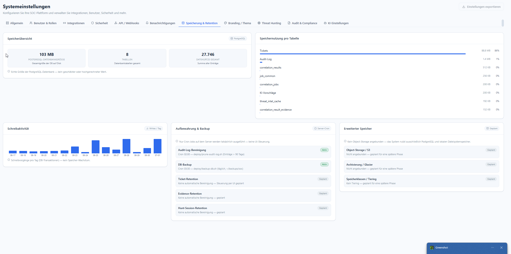

# Speicherung & Retention

**Menü:** Systemeinstellungen → Tab **Speicherung & Retention**

!!! note "Rolle"
    Read-only-Übersicht. Aufbewahrung wird serverseitig über **Cron-Jobs** durchgesetzt — keine
    UI-Steuerung.

## Speicherübersicht

Echte Werte aus der PostgreSQL-Datenbank (kein Schätzwert):

- **Datenbankgröße** — Gesamtgröße auf Disk (z. B. `103 MB`).
- **Tabellen** — Anzahl DB-Tabellen.
- **Datensätze gesamt** — Summe aller Einträge.

Die Karte **Speichernutzung pro Tabelle** zeigt, welche Tabellen den Platz belegen (typisch
dominiert `Tickets`), gefolgt von `Audit-Log`, `correlation_results`, `threat_intel_cache` u. a.
**Schreibaktivität** stellt DB-Transaktionen pro Tag dar (kein Speicher-Wachstum).

## Aufbewahrung & Backup *(Server-Cron)*

Nur Cron-Jobs auf dem Server werden tatsächlich ausgeführt — es gibt keine UI-Steuerung.

| Job | Status | Details |
|---|---|---|
| **Audit-Log-Bereinigung** | Aktiv | Cron 02:00 — `deploy/prune-audit-log.sh`, Einträge > 90 Tage |
| **DB-Backup** | Aktiv | Cron 03:30 — `deploy/backup-db.sh` (täglich, `~/backups/soc`) |
| **Ticket-Retention** | Geplant | Keine automatische Bereinigung — Steuerung per UI geplant |
| **Evidence-Retention** | Geplant | Keine automatische Bereinigung — geplant |
| **Hunt-Session-Retention** | Geplant | Keine automatische Bereinigung — geplant |

## Erweiterter Speicher *(geplant)*

Aktuell nutzt das System **ausschließlich PostgreSQL und lokalen Dateisystemspeicher**. Kein
Object-Storage angebunden. Für spätere Phasen vorgesehen: **Object-Storage / S3**,
**Archivierung / Glacier**, **Speicherklassen / Tiering**.

!!! tip "Restore"
    Der Restore-Weg zum `backup-db.sh`-Dump ist im Betriebshandbuch beschrieben — siehe
    [Betrieb](../07-operations/README.md).
