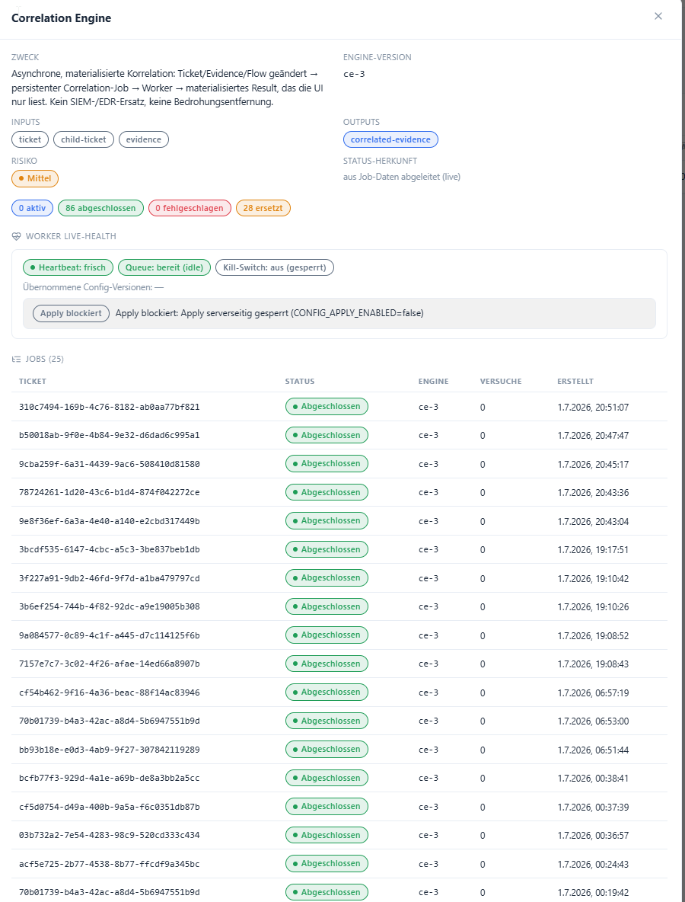
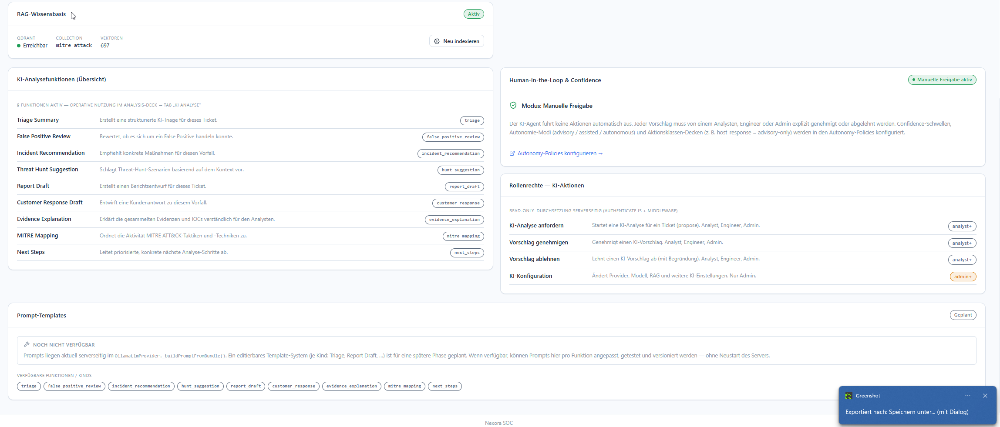
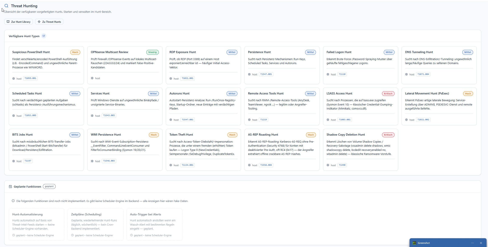

# Was Nexora macht

!!! abstract "In einem Satz"
    Nexora ist der **Analyst-Copilot und die Orchestrierungsschicht** für ein SOC — es sitzt
    *über* SIEM/EDR (Wazuh, QRadar, Splunk), macht aus rohen Alerts nachvollziehbare,
    angereicherte, priorisierte **Tickets** und bereitet Entscheidungen vor. Der Mensch
    entscheidet, Nexora liefert die Belege.

Diese Seite erklärt **was das System tut** — kompakt und anhand echter Screenshots. Für den
ausführlichen Funktionskatalog, die Abgrenzung und das Glossar siehe
[Produkt & Funktionsumfang](../00-overview/produkt-erklaerung.md). Wie ein Analyst konkret damit
arbeitet, steht unter [Bedienung](../02-user-guide/user-guide.md); wie man es einrichtet unter
[Administration](../administration/index.md).

## Der zentrale Ablauf

```
Rohdaten  →  Adapter  →  Ticket  →  Anreicherung  →  KI-Analyse  →  Entscheidung  →  Report
(SIEM)       (validiert   (normali-   (Threat-Intel,   (Vorschlag     (Mensch gibt      (PDF/CSV,
             + normali-   siert,       Host-Kontext,    mit Belegen)   frei, Audit,      Chain of
             siert)       dedupl.)     MITRE-Mapping)                  rückrollbar)      Custody)
```

Jeder Schritt ist **auditiert** und — wo es kritisch wird — **freigabepflichtig und rückrollbar**.

## Die Bausteine im Überblick

### 1. Aufnahme über Adapter (kein SIEM-Ersatz)
Jede Quelle (Wazuh, QRadar, Splunk, generische Webhooks) wird über einen **Adapter** validiert
und in ein einheitliches Ticket-Format übersetzt. HMAC-signiert, mit Replay-Schutz. Nichts
Externes wird ungeprüft übernommen. → Einrichtung: [Integrationen](../administration/integrationen.md).

### 2. Ticketing & Korrelation
Alerts werden zu **Tickets** normalisiert, dedupliziert und dem Host-Kontext zugeordnet. Eine
asynchrone **Correlation Engine** verknüpft Ticket/Evidence/Flow zu einem materialisierten
Ergebnis, das die UI nur liest — keine automatische Bedrohungsentfernung.



### 3. Anreicherung & Threat Intelligence
IOCs (IP, Domain, Hash) werden extrahiert und gegen **VirusTotal** und **AbuseIPDB** bewertet;
Host-Inventar, SCA und CVEs kommen aus Wazuh; Techniken werden auf **MITRE ATT&CK** gemappt.

### 4. KI-Copilot mit Human-in-the-loop
Der KI-Agent erzeugt **Vorschläge** (Triage, False-Positive-Review, Empfehlung, Report-Entwurf,
MITRE-Mapping …) — nie selbsttätige Aktionen. Jeder Vorschlag ist mit Beweisen hinterlegt
(Anti-Halluzinations-Guardrails) und durchläuft einen Freigabe-Workflow.



### 5. Threat Hunting
Ein Katalog MITRE-gemappter **Hunts** läuft per Knopfdruck gegen die Wazuh-Daten; Funde werden
zu Tickets oder Evidence.



### 6. Nachweisbarkeit
Jeder Vorgang trägt eine vollständige **Beweiskette** (Evidence, Chain of Custody, Audit-Trail),
exportierbar als PDF/CSV.

## Was Nexora *nicht* ist

- ❌ kein **SIEM-Ersatz** (erkennt nicht selbst, sondern konsumiert/korreliert)
- ❌ kein **EDR/Antivirus** (entfernt keine Malware, greift nicht auf Endpunkten ein)
- ❌ keine **Auto-Remediation** (kritische Aktionen werden vorbereitet, nie automatisch ausgeführt)
- ❌ kein **Konformitätsnachweis** (NIS2-Modul ist Arbeits-/Nachweiswerkzeug, keine Zertifizierung)
- ❌ kein **Remote-Command-Kanal** (Provisioning ist read-only; der Server sendet nie Befehle zurück)

Diese Grenzen sind im Code durch Tests abgesichert. Details:
[Produkt & Funktionsumfang → Abgrenzung](../00-overview/produkt-erklaerung.md#4-abgrenzung--was-nexora-nicht-ist).
